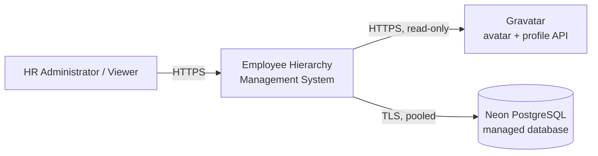
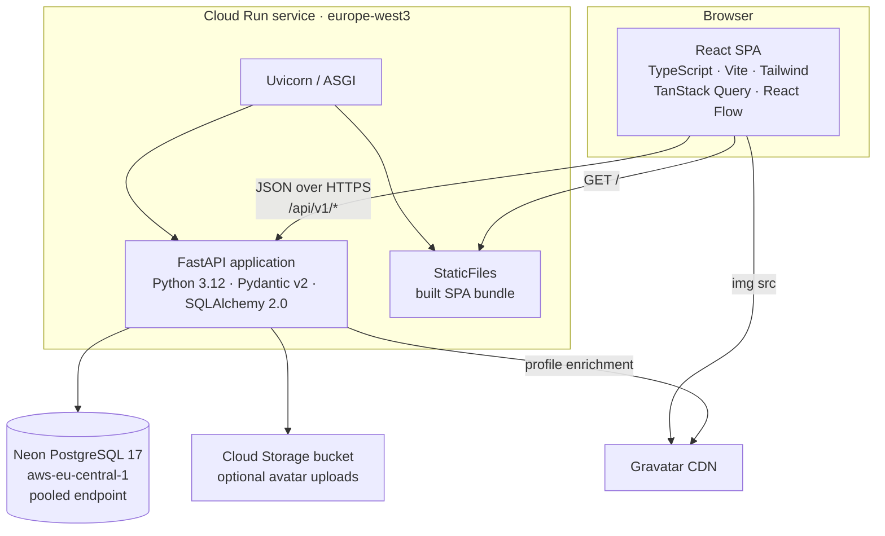
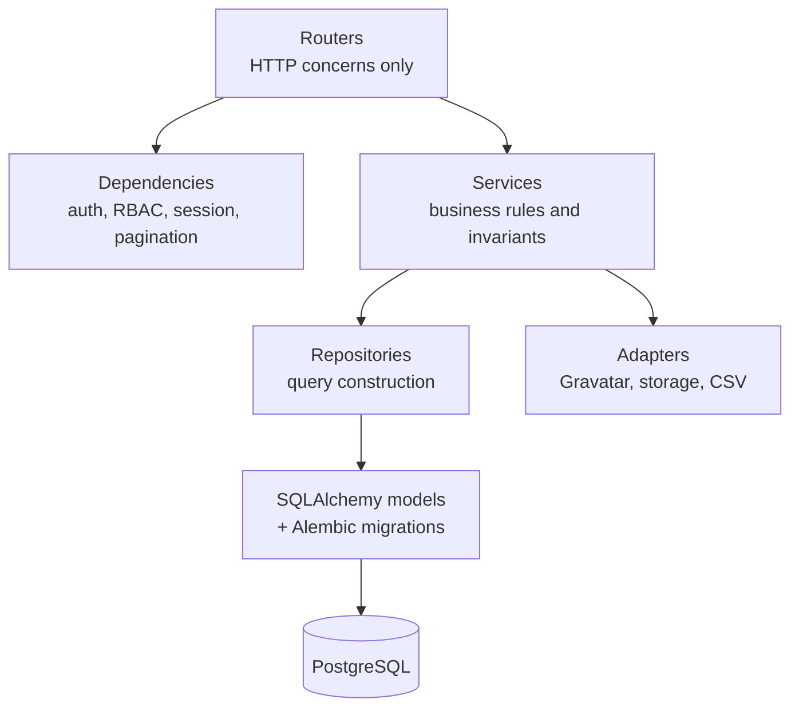
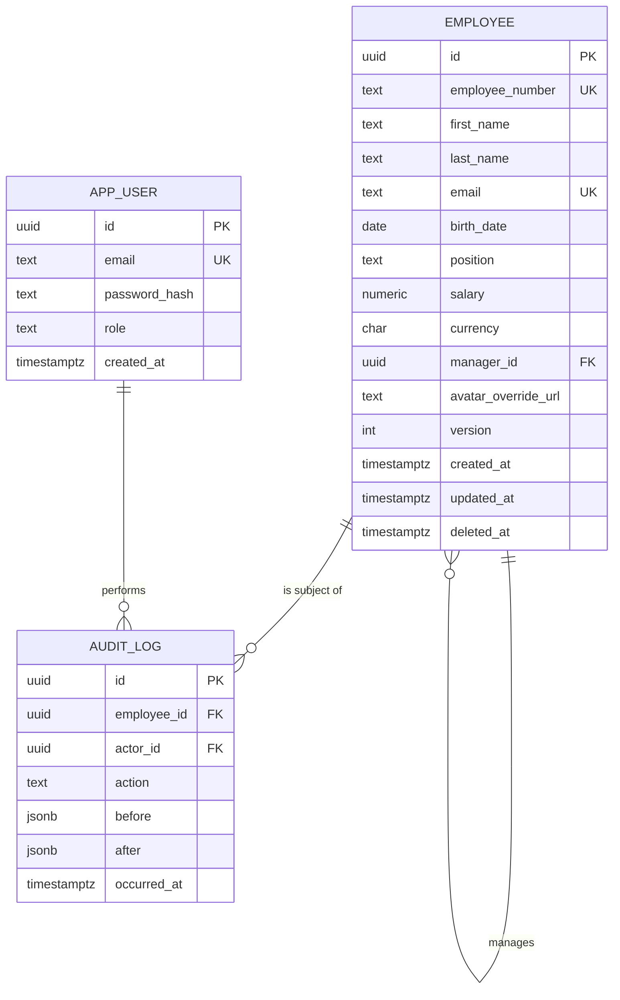

# Employee Hierarchy Management System
## Technical Design Document

| | |
|---|---|
| **Prepared for** | EPI-USE Africa - Technical Services Internship Assessment |
| **Author** | Michael Koch |
| **Version** | 1.1 |
| **Date** | «submission date» |
| **Live application** | «https://…run.app» |
| **API documentation** | «https://…run.app/docs» (interactive OpenAPI) |
| **Source repository** | «https://github.com/…» |
| **Container image** | «europe-west3-docker.pkg.dev/…» |
| **Demo credentials** | Admin: «…» · Read-only: «…» |

> Placeholders marked «…» must be filled before submission.

---

## 1. Executive summary

This document describes the design of a cloud-hosted web application that manages EPI-USE Africa's employee records and reporting hierarchy.

The system is a **single-page React application served by a containerised Python API over a managed PostgreSQL database**. It provides full CRUD over employee records, an interactive and searchable organisational chart, a sortable and filterable reporting table, and Gravatar-based avatars. Beyond the brief it adds role-based access control with salary confidentiality, a full audit trail, CSV import/export, and organisational analytics.

Three decisions shape the design, and the rest of this document justifies them:

1. **PostgreSQL with an adjacency-list hierarchy and recursive CTEs.** The reporting structure is a rooted forest, and the hard part is not storing it but keeping it *provably acyclic* under concurrent edits. A relational database with transactional integrity, declarative constraints and recursive queries solves that directly; a document store does not.
2. **An explicit, versioned, self-documenting HTTP API.** The API is a first-class deliverable rather than an implementation detail of the UI. It is generated as an OpenAPI 3.1 specification from the same type definitions that validate requests at runtime, so the contract cannot drift from the code.
3. **One container as the unit of deployment.** The same image runs on a developer laptop, in CI, and in production on Google Cloud Run. There is no environment-specific packaging step, and therefore no class of bug that appears only in production.

---

## 2. Requirements

### 2.1 Functional requirements

| ID | Requirement | Source |
|---|---|---|
| FR-1 | Create, read, update and delete employee records | Brief |
| FR-2 | Record name, surname, birth date, employee number, salary, role/position and reporting line manager | Brief |
| FR-3 | Set and change an employee's reporting line manager | Brief |
| FR-4 | An employee may not be their own manager | Brief |
| FR-5 | An employee may have no manager (e.g. the CEO) | Brief |
| FR-6 | Present the hierarchy as a visual tree or graph | Brief |
| FR-7 | Search the hierarchy to find, edit or delete an employee | Brief |
| FR-8 | Provide a table/list view sortable and filterable on any employee field | Brief |
| FR-9 | Display Gravatar avatars linked to employee data | Brief |
| FR-10 | Optionally support avatar upload | Brief (nice-to-have) |
| FR-11 | Prevent indirect reporting cycles (A → B → C → A) | Derived from FR-4 |
| FR-12 | Define deletion behaviour for an employee who has direct reports | Derived from FR-1 |
| FR-13 | Role-based access with salary visibility restricted to authorised roles | Added |
| FR-14 | Audit trail of all data changes | Added |
| FR-15 | Bulk CSV/Excel import with validation, and full data export | Added |
| FR-16 | Organisational analytics (headcount, cost roll-up, span of control) | Added |

### 2.2 Non-functional requirements

| ID | Requirement | Target |
|---|---|---|
| NFR-1 | Publicly reachable over HTTPS from a single URL | 100% of assessment window |
| NFR-2 | All state persisted in a remote database; no hardcoded or file-based data | Absolute constraint |
| NFR-3 | Read latency for hierarchy and list views | p95 < 400 ms at 1 000 employees |
| NFR-4 | Hierarchy remains acyclic under concurrent writes | Enforced at database level |
| NFR-5 | Salary values never returned to unauthorised principals | Enforced server-side |
| NFR-6 | Automated test coverage on domain and service layers | ≥ 80% |
| NFR-7 | Reproducible builds and one-command local startup | `docker compose up` |
| NFR-8 | WCAG 2.1 AA for keyboard navigation and contrast | Audited via Lighthouse/axe |
| NFR-9 | Alignment with POPIA principles for personal information | Documented in §9.5 |

### 2.3 Requirements traceability

| Requirement | Implemented by | Verified by |
|---|---|---|
| FR-1, FR-2 | `EmployeeService`, `/api/v1/employees` | Integration tests `test_employee_crud.py` |
| FR-3 | `PUT /employees/{id}/manager`, `ReassignmentService` | `test_reassignment.py` |
| FR-4 | `CHECK (manager_id IS DISTINCT FROM id)` | `test_self_manager_rejected` |
| FR-5 | Nullable `manager_id`; `GET /hierarchy/roots` | `test_root_employee` |
| FR-6 | `OrgChart` component (React Flow + Dagre) | Manual + Playwright smoke test |
| FR-7 | `GET /search`, command palette, chart focus mode | `test_search.py` |
| FR-8 | `GET /employees` with whitelisted sort/filter params | `test_list_filtering.py` |
| FR-9 | `GravatarAdapter` (SHA-256 email hash) | `test_gravatar.py` |
| FR-11 | Deferred constraint trigger + service pre-check | `test_cycle_prevention.py` |
| FR-12 | `DeletionPolicy` strategy | `test_deletion_policies.py` |
| FR-13 | RBAC dependency + response schema selection | `test_salary_redaction.py` |
| FR-14 | `AuditLog` written inside the unit of work | `test_audit_trail.py` |

---

## 3. Architecture

### 3.1 Architectural style

The solution is a **client–server application composed of a single-page application and a stateless HTTP API over a managed relational database**. Internally the API is a **layered modular monolith**: a single deployable unit whose modules (employees, hierarchy, auth, audit, analytics, import/export) are separated by explicit interfaces rather than by network boundaries. The SPA and the API ship together in **one container image**.

It is worth being precise about what this architecture is *not*, because these labels are commonly misapplied:

- **Not microservices.** There is one deployable service with one database schema and one transactional boundary. Splitting it would introduce distributed-transaction problems for an invariant (acyclicity) that must be enforced atomically.
- **Not event-driven.** Communication is synchronous request/response. The optional outbound webhooks (§10.7) are a notification mechanism layered on top of synchronous writes, not an event-sourced or message-brokered core.
- **Not serverless in the functions-as-a-service sense.** The application is an ordinary long-lived ASGI process in a container. Cloud Run is a managed container platform that happens to scale to zero - it executes the same image `docker run` would. The distinction matters: the application is written against no platform-specific handler API, so moving it to ECS, Kubernetes or a plain virtual machine is a configuration change rather than a rewrite.

This choice is deliberate. For a bounded domain with a single strong consistency requirement and a one-week delivery window, a modular monolith gives the strongest correctness guarantees at the lowest operational cost. The module boundaries are drawn so that extraction into separate services remains possible if the domain later warranted it.

### 3.2 System context



### 3.3 Container view

A single Cloud Run service serves both the API and the built SPA. This removes cross-origin requests entirely in production, removes a second deployment pipeline, and means the application has exactly one public URL.



**Route precedence inside the container.** The API mounts first and the static bundle acts as the fallback, so ordering is explicit rather than incidental:

1. `/api/v1/*` → API routers
2. `/docs`, `/redoc`, `/openapi.json` → generated documentation
3. `/assets/*` → hashed, immutable static assets
4. anything else → `index.html`, so client-side routes such as `/employees/018f…` survive a page refresh

### 3.4 API component view



**Layer responsibilities and rules:**

| Layer | Responsibility | May not |
|---|---|---|
| Router | Parse and validate HTTP input, select response schema, map domain exceptions to status codes | Contain business rules or touch the session directly |
| Dependency | Authenticate, authorise, open the unit of work, parse pagination | Perform writes |
| Service | Enforce invariants, orchestrate transactions, emit audit records | Know about HTTP |
| Repository | Build and execute queries, return domain objects | Enforce business rules |
| Adapter | Wrap external systems behind a narrow port | Leak vendor types upward |

The one-directional dependency rule means the domain and service layers are testable without a web server, and the Gravatar integration is replaceable with a fake in tests.

### 3.5 Request lifecycle - reassigning a manager

1. The user drags an employee card onto a new manager in the org chart.
2. The SPA optimistically updates its cache and issues `PUT /api/v1/employees/{id}/manager` with `If-Match: "<version>"`.
3. A FastAPI dependency validates the JWT and asserts the `hr_admin` role.
4. A second dependency checks a connection out of the pool and begins a transaction.
5. `ReassignmentService` locks the employee row (`SELECT … FOR UPDATE`), checks the optimistic-lock version, then runs the subtree query of §4.6 to confirm the proposed manager is not a descendant.
6. The update is applied and an `audit_log` row is written in the same transaction.
7. The deferred acyclicity trigger re-validates at `COMMIT`, closing the race window described in §5.2.
8. The router returns `200 OK` with the new version; on conflict it returns `409` and the SPA rolls the optimistic update back and refetches.

---

## 4. Data design

### 4.1 Domain model

The domain has one aggregate root, `Employee`, which owns its identity, personal data, remuneration and its single reporting edge. The organisation as a whole is a **rooted forest**: every employee has at most one manager, and one or more employees have none.

Deliberate modelling choices:

- **Position is a string field, not a separate `Role` entity.** The brief asks for a role/position on the employee record. Normalising it into a table would add a join and a management screen for no requirement. This is noted as a roadmap item (§15) rather than pretended away.
- **`employee_number` is a natural key but not the primary key.** It is business-assigned, human-visible and potentially re-sequenced. A surrogate UUID primary key keeps foreign keys stable if numbering policy changes.
- **UUIDv7 rather than UUIDv4.** UUIDv7 is time-ordered, which preserves B-tree index locality on insert and avoids the write amplification of random UUIDs, while remaining non-enumerable in URLs.

### 4.2 Entity-relationship diagram



### 4.3 Choosing a hierarchy representation

This is the central data-design decision, so the alternatives are set out in full.

| Option | Read cost | Write cost | Integrity | Verdict |
|---|---|---|---|---|
| **Adjacency list + recursive CTE** | One recursive query per subtree | O(1) - update one column | Self-reference prevented declaratively; cycles prevented by trigger | **Selected** |
| Materialised path (`/ceo/cto/eng/`) | Very fast prefix scan | O(subtree) - rewrite every descendant path | Cycles impossible by construction, but paths can desynchronise | Rejected |
| Closure table (ancestor/descendant pairs) | Fastest - single indexed join | O(ancestors × descendants) rows rewritten per move | Strong, but duplicated state to keep consistent | Rejected at this scale |
| `ltree` extension | Fast, with operators and GiST indexing | Same rewrite cost as materialised path | Good, but extension-dependent | Rejected |
| Graph database (Neo4j) | Excellent traversal | Good | Excellent for traversal; weak for the tabular reporting view | Rejected |

**Rationale.** The workload is write-light and read-moderate at an organisational scale measured in thousands, not millions. Recursive CTEs in PostgreSQL resolve a 5 000-node subtree in single-digit milliseconds with an index on `manager_id`. Every alternative buys read speed the system does not need by paying in derived state that can drift from the truth - and drift is precisely the failure mode this domain cannot tolerate. The adjacency list keeps exactly one authoritative representation of the reporting edge.

The graph database deserves a word, because a reporting structure is a natural graph. It was rejected because the structure here is the *simple* case of a graph - a single-parent forest - which relational databases handle natively, while the brief's tabular reporting, sorting and filtering requirements are where relational databases are strongest and graph databases weakest. Adopting Neo4j would optimise the easy half of the problem and complicate the hard half.

If the system later needed sub-millisecond ancestor lookups across a million rows, the migration path is to add a closure table as a derived read model maintained by trigger, leaving the adjacency list authoritative.

### 4.4 Schema

```sql
CREATE TABLE employee (
    id                  UUID PRIMARY KEY,
    employee_number     TEXT        NOT NULL,
    first_name          TEXT        NOT NULL,
    last_name           TEXT        NOT NULL,
    email               TEXT        NOT NULL,
    birth_date          DATE        NOT NULL,
    position            TEXT        NOT NULL,
    salary              NUMERIC(12,2) NOT NULL,
    currency            CHAR(3)     NOT NULL DEFAULT 'ZAR',
    manager_id          UUID        REFERENCES employee(id) ON DELETE SET NULL,
    avatar_override_url TEXT,
    version             INTEGER     NOT NULL DEFAULT 1,
    created_at          TIMESTAMPTZ NOT NULL DEFAULT now(),
    updated_at          TIMESTAMPTZ NOT NULL DEFAULT now(),
    deleted_at          TIMESTAMPTZ,

    CONSTRAINT employee_not_own_manager CHECK (manager_id IS DISTINCT FROM id),
    CONSTRAINT employee_salary_non_negative CHECK (salary >= 0),
    CONSTRAINT employee_birth_date_sane CHECK (birth_date > DATE '1900-01-01')
);

CREATE UNIQUE INDEX uq_employee_number ON employee (employee_number)
    WHERE deleted_at IS NULL;
CREATE UNIQUE INDEX uq_employee_email  ON employee (lower(email))
    WHERE deleted_at IS NULL;
CREATE INDEX ix_employee_manager       ON employee (manager_id)
    WHERE deleted_at IS NULL;
CREATE INDEX ix_employee_name_trgm     ON employee
    USING GIN ((first_name || ' ' || last_name) gin_trgm_ops);
```

Three details worth noting:

- **`IS DISTINCT FROM` rather than `<>`.** A plain `manager_id <> id` evaluates to `NULL` when `manager_id` is `NULL`, and a `CHECK` constraint passes on `NULL`. It would work by accident here, but `IS DISTINCT FROM` states the intent unambiguously and is correct for all inputs.
- **Birth date "not in the future" is enforced in the application, not the schema.** `CURRENT_DATE` is not immutable; embedding it in a `CHECK` constraint produces a predicate whose truth changes over time, which can make a valid backup impossible to restore. The schema constrains only what is time-invariant; the temporal rule lives in the Pydantic validator, where it is also testable.
- **Partial unique indexes** (`WHERE deleted_at IS NULL`) allow an employee number to be reused after a soft delete without weakening uniqueness among active records.

### 4.5 Soft deletion

Employee records are soft-deleted by default (`deleted_at` set) rather than physically removed. Personnel data has audit and compliance value, accidental deletion in a hierarchy is destructive, and a restore path is cheap to provide. A hard-delete endpoint exists for genuine erasure requests (§9.5), and it cascades the audit rows explicitly rather than silently.

### 4.6 Key queries

**Full subtree with depth, and a defensive cycle guard:**

```sql
WITH RECURSIVE subtree AS (
    SELECT e.*, 0 AS depth, ARRAY[e.id] AS path
    FROM employee e
    WHERE e.id = :root_id AND e.deleted_at IS NULL
  UNION ALL
    SELECT c.*, s.depth + 1, s.path || c.id
    FROM employee c
    JOIN subtree s ON c.manager_id = s.id
    WHERE c.deleted_at IS NULL
      AND NOT c.id = ANY(s.path)          -- terminates even on corrupt data
)
SELECT * FROM subtree ORDER BY depth, last_name;
```

**Reporting-line (ancestor chain) for breadcrumbs and chart focus mode:**

```sql
WITH RECURSIVE line AS (
    SELECT e.id, e.manager_id, 0 AS level
    FROM employee e WHERE e.id = :employee_id
  UNION ALL
    SELECT m.id, m.manager_id, l.level + 1
    FROM employee m JOIN line l ON m.id = l.manager_id
    WHERE l.level < 100
)
SELECT * FROM line WHERE level > 0 ORDER BY level;
```

**Cycle safety check before reassignment** - the proposed manager must not be inside the employee's own subtree:

```sql
SELECT NOT EXISTS (
    WITH RECURSIVE subtree AS (
        SELECT id FROM employee WHERE id = :employee_id
      UNION ALL
        SELECT c.id FROM employee c JOIN subtree s ON c.manager_id = s.id
    )
    SELECT 1 FROM subtree WHERE id = :new_manager_id
) AS is_safe;
```

**Cost and headcount roll-up for any branch** (powers the analytics panel):

```sql
SELECT count(*) AS headcount,
       sum(salary) AS total_annual_cost,
       round(avg(salary), 2) AS average_salary,
       max(depth) AS depth_below
FROM subtree;
```

---

## 5. Business rules and invariants

### 5.1 The invariants

| # | Invariant | Enforcement |
|---|---|---|
| I-1 | An employee is never their own manager | `CHECK` constraint (database) |
| I-2 | The reporting structure contains no cycles of any length | Deferred constraint trigger + service pre-check |
| I-3 | A manager reference always points to an existing, non-deleted employee | Foreign key + partial index |
| I-4 | Employee number and email are unique among active employees | Partial unique indexes |
| I-5 | Concurrent edits cannot silently overwrite one another | Optimistic lock on `version` |
| I-6 | Every mutation is attributable to a principal and a timestamp | Audit write inside the same transaction |

### 5.2 Cycle prevention, and why the obvious approach is not enough

The naive implementation checks "is the new manager inside this employee's subtree?" in application code and then writes. That check is correct in isolation and **wrong under concurrency**. Two simultaneous reassignments - A moved under B, and B moved under A - can each pass their own check against a snapshot that predates the other, and commit a cycle that neither request could have created alone.

An autoscaling platform heightens this risk rather than reducing it: Cloud Run may run several instances of the application at once, so two conflicting requests can genuinely execute in separate processes. Any lock held in application memory is therefore worthless, and the invariant must be enforced by the database.

Three layers address this:

1. **Row-level locking.** The service takes `SELECT … FOR UPDATE` on the employee and the proposed manager before validating, serialising conflicting moves on the same rows regardless of which instance handles them.
2. **A deferred constraint trigger.** Validation is re-run at `COMMIT`, after all statements in the transaction have been applied, so a cycle assembled from several statements is still caught.
3. **A defensive path guard in every recursive read** (`NOT id = ANY(path)`), so that even if corrupt data somehow existed, reads terminate rather than looping.

```sql
CREATE OR REPLACE FUNCTION assert_no_reporting_cycle() RETURNS trigger AS $$
DECLARE
    cursor_id UUID := NEW.manager_id;
    hops      INT  := 0;
BEGIN
    WHILE cursor_id IS NOT NULL LOOP
        IF cursor_id = NEW.id THEN
            RAISE EXCEPTION 'Reporting cycle detected for employee %', NEW.id
                USING ERRCODE = 'check_violation';
        END IF;
        SELECT manager_id INTO cursor_id FROM employee WHERE id = cursor_id;
        hops := hops + 1;
        IF hops > 1000 THEN
            RAISE EXCEPTION 'Reporting chain exceeds maximum supported depth';
        END IF;
    END LOOP;
    RETURN NEW;
END;
$$ LANGUAGE plpgsql;

CREATE CONSTRAINT TRIGGER employee_no_cycle
    AFTER INSERT OR UPDATE OF manager_id ON employee
    DEFERRABLE INITIALLY DEFERRED
    FOR EACH ROW EXECUTE FUNCTION assert_no_reporting_cycle();
```

The service-layer pre-check is not redundant with the trigger: it exists to return a clear, actionable `422` naming the offending employee, rather than surfacing a database exception to the user.

### 5.3 Deleting an employee who has direct reports

The brief does not specify what happens to an employee's reports when that employee is removed, which makes it a design decision rather than an omission. Three policies are implemented behind a **strategy interface**, selected per request:

| Policy | Behaviour | Default for |
|---|---|---|
| `reparent` | Direct reports are reassigned to the deleted employee's manager | Ordinary departures - preserves the chain |
| `promote_to_root` | Direct reports become managerless and appear as new roots | Removing a root, or restructuring |
| `cascade` | The entire subtree is soft-deleted | Closing a whole department |

The UI never applies `cascade` silently: it requests a preview first, showing the exact count and names of affected employees, and requires explicit confirmation. Deleting a root with `reparent` degrades gracefully to `promote_to_root`, since there is no grandparent to reparent to.

### 5.4 Concurrency control

Every write carries the record's `version`, supplied as an `If-Match` header. A mismatch returns `409 Conflict` with both the client's stale representation and the current server state, so the UI can present a meaningful "this record changed while you were editing" dialogue rather than discarding one user's work. Pessimistic locking was rejected: lock lifetime across a human editing session is unbounded, and conflicts in this domain are rare enough that optimistic control is the better trade.

---

## 6. API design

### 6.1 Principles

Resource-oriented, versioned under `/api/v1`, JSON only, no verbs in paths. State-changing operations that carry their own business rules get a dedicated sub-resource rather than being folded into a general `PATCH`, because their authorisation, validation and audit semantics differ.

### 6.2 Endpoints

| Method | Path | Purpose | Role |
|---|---|---|---|
| `POST` | `/auth/login` | Exchange credentials for access + refresh tokens | Public |
| `POST` | `/auth/refresh` | Rotate refresh token | Authenticated |
| `GET` | `/auth/me` | Current principal and capability flags | Authenticated |
| `GET` | `/employees` | Paginated list; sort, filter, free-text search | Viewer |
| `POST` | `/employees` | Create employee | Admin |
| `GET` | `/employees/{id}` | Single employee with manager and direct reports | Viewer |
| `PATCH` | `/employees/{id}` | Partial update (optimistic lock) | Admin |
| `DELETE` | `/employees/{id}` | Soft delete with `?policy=` | Admin |
| `POST` | `/employees/{id}/restore` | Undo a soft delete | Admin |
| `GET` | `/employees/{id}/deletion-preview` | Affected records for a given policy | Admin |
| `PUT` | `/employees/{id}/manager` | Reassign reporting line | Admin |
| `GET` | `/employees/{id}/subtree` | Descendants to `?depth=` | Viewer |
| `GET` | `/employees/{id}/reporting-line` | Ancestor chain to the root | Viewer |
| `GET` | `/employees/{id}/audit` | Change history for one employee | Admin |
| `GET` | `/hierarchy/roots` | Employees with no manager | Viewer |
| `GET` | `/hierarchy/tree` | Chart-shaped payload, lazily expandable | Viewer |
| `GET` | `/analytics/org-summary` | Headcount, depth, span-of-control, anomalies | Viewer |
| `GET` | `/analytics/branch/{id}` | Cost and headcount roll-up for a branch | Admin |
| `POST` | `/imports/employees` | CSV/XLSX upload; `?dry_run=true` validates only | Admin |
| `GET` | `/exports/employees.csv` | Full extract honouring current filters | Viewer |
| `GET` | `/search` | Cross-entity quick search for the command palette | Viewer |
| `GET` | `/health` | Liveness and database reachability | Public |

### 6.3 List query contract

```
GET /api/v1/employees
    ?q=jansen                      # trigram fuzzy match on name, position, employee number
    &position=Integration+Architect
    &manager_id=<uuid>
    &min_salary=450000&max_salary=900000
    &sort=last_name&order=asc      # sort field validated against an allow-list
    &page=1&page_size=50
```

`sort` is resolved against a static map of permitted column names. Dynamic `ORDER BY` built from raw user input is the classic injection vector that parameterised queries do **not** protect against, because identifiers cannot be bound as parameters. Sorting and filtering are performed in the database, not in the browser, so the table view remains correct and fast when the dataset outgrows a single page.

### 6.4 Error model

All errors return `application/problem+json` per RFC 9457:

```json
{
  "type": "https://«host»/errors/reporting-cycle",
  "title": "Reassignment would create a reporting cycle",
  "status": 422,
  "detail": "Thandi Mokoena reports to Michael Koch indirectly and cannot become his manager.",
  "instance": "/api/v1/employees/018f.../manager",
  "errors": [{ "field": "manager_id", "code": "cycle_detected" }]
}
```

A single exception-handler layer maps domain exceptions to problem documents, so routers contain no error-formatting logic and messages stay consistent.

### 6.5 Contract documentation

FastAPI derives an OpenAPI 3.1 document from the same Pydantic models used for runtime validation, so the published contract cannot drift from the implementation. Swagger UI is served at `/docs` and ReDoc at `/redoc`, both publicly reachable for assessment. A Postman collection is generated from the specification and committed to the repository.

---

## 7. Frontend design

### 7.1 Structure

```
src/
  app/            routing, providers, error boundaries
  features/
    employees/    list view, detail drawer, forms
    hierarchy/    org chart, node renderers, layout
    analytics/    summary cards, distributions
    auth/         login, session, capability gates
  components/ui/  shadcn/ui primitives
  lib/            generated API client, hooks, formatters
```

Feature-first rather than type-first: everything needed to change the org chart lives in one directory, which keeps the module boundaries in the UI aligned with those in the API.

The SPA is built with Vite and the resulting bundle is copied into the API image at build time (§10.3), so the frontend is deployed as part of the same artefact and can never be a version behind the API it talks to.

### 7.2 State management

Server state and client state are handled separately, which avoids the most common source of accidental complexity in data-heavy UIs.

- **Server state - TanStack Query.** Caching, deduplication, background refetch, optimistic updates and rollback are solved rather than reimplemented. Query keys are derived from the filter object, so changing a filter is a cache lookup rather than a manual refetch.
- **Client state - React state and URL search params.** Filters, sort order and the selected employee live in the URL, which makes every view shareable and bookmarkable and gives back/forward navigation for free.
- **A global store was deliberately not introduced.** Redux or Zustand would add a layer whose primary job - caching server data - is already covered.

### 7.3 Rendering the hierarchy

**React Flow with a Dagre layout pass** was selected over hand-rolled D3 and over off-the-shelf org-chart libraries. React Flow supplies pan, zoom, minimap, viewport virtualisation and drag interaction; Dagre computes a deterministic layered tree layout; node rendering stays as ordinary React components, so an employee card in the chart reuses the same avatar and badge components as the table view.

Behaviour at scale:

- The chart requests the tree lazily - roots plus two levels initially, then a subtree fetch on expand - so a 5 000-employee organisation does not serialise into a single response.
- **Focus mode** renders an employee's full ancestor chain plus a configurable depth of descendants, which is how people actually read an org chart.
- Searching selects and centres the matching node, expanding collapsed ancestors along the way.
- **Drag-and-drop reassignment**: dropping a card onto another employee issues the reassignment call. Invalid targets - the employee's own descendants - are computed client-side from the loaded subtree and shown as non-droppable *before* the drop, with the server remaining the authority.

### 7.4 Table view

TanStack Table in fully controlled mode, with sorting, filtering and pagination delegated to the server (§6.3). Column visibility is user-configurable and persisted per session; salary columns are absent entirely for unauthorised roles rather than hidden client-side.

### 7.5 Accessibility and responsiveness

Forms are built on Radix primitives via shadcn/ui, giving correct focus management, labelling and `aria` semantics. The chart, being inherently visual, has an equivalent accessible path: a keyboard-navigable nested-list view of the same hierarchy, which also serves as the print view. Colour is never the sole carrier of meaning. Target: Lighthouse accessibility ≥ 95 and zero critical axe violations.

---

## 8. Gravatar integration

### 8.1 Avatar resolution

Gravatar identifies users by a hash of their email address. The current specification uses **SHA-256** of the address after trimming whitespace and lower-casing it - MD5 is legacy and is not used here.

```python
def gravatar_url(email: str, size: int = 200, default: str = "mp") -> str:
    digest = hashlib.sha256(email.strip().lower().encode("utf-8")).hexdigest()
    query = urlencode({"s": size, "d": default, "r": "pg"})
    return f"https://gravatar.com/avatar/{digest}?{query}"
```

Resolution follows a deterministic fallback chain: an uploaded override, then the Gravatar image, then a generated initials avatar rendered locally. The `d` parameter handles the fallback server-side at Gravatar's CDN, so a missing avatar never produces a broken image.

### 8.2 Design decisions

- **The hash is computed server-side and returned as part of the employee representation.** The browser never needs the raw email to render an avatar, which keeps addresses out of any client-side caching or logging path.
- **Images are requested directly by the browser from Gravatar's CDN**, not proxied. Proxying would put an external dependency in the critical path of every API response and consume container CPU for no benefit.
- **The integration sits behind an `AvatarProvider` port.** The Gravatar implementation is one adapter; a fake is injected in tests so the suite makes no network calls, and an internal provider could be substituted without touching the service layer.
- **Requested size is capped and `r=pg` is enforced**, so the application never renders an unrated third-party image in a corporate context.
- **Failures are non-fatal.** Avatar rendering is presentation, never a reason for a request to fail.

### 8.3 Optional upload

The nice-to-have upload path stores images in a Cloud Storage bucket and records the resulting URL in `avatar_override_url`, which takes precedence over Gravatar. Uploads are validated by content sniffing rather than by file extension, re-encoded to strip EXIF metadata (which can carry GPS coordinates), capped at 2 MB, and served from a bucket with no execute permission and a restrictive CORS policy.

### 8.4 Profile enrichment

Gravatar also exposes a public profile API. When an administrator enters an email on the create-employee form, the system looks it up and offers to prefill display name, job title and location, which the administrator can accept or ignore. It is a small feature that demonstrates the integration is understood as a data source rather than only an image URL.

---

## 9. Security and privacy

### 9.1 Authentication

Email and password, with **Argon2id** hashing (memory-hard, and the current OWASP recommendation over bcrypt for new systems). Short-lived JWT access tokens (15 minutes) with rotating refresh tokens. Tokens are signed with HS256 using a secret held in Google Secret Manager and injected at container start; it is never committed to the repository and never baked into the image.

### 9.2 Authorisation

Two roles, kept deliberately minimal:

| Role | Read employees | Read salary | Write | Import/export | Audit log |
|---|---|---|---|---|---|
| `viewer` | ✓ | ✗ | ✗ | Export only | ✗ |
| `hr_admin` | ✓ | ✓ | ✓ | ✓ | ✓ |

Authorisation is a route-level dependency, so an endpoint cannot be added without a policy decision being made explicitly.

### 9.3 Salary confidentiality

Salary is the one field in this dataset with genuine confidentiality weight, and it is handled as a **field-level authorisation** concern rather than a UI concern. The API selects a different response schema by role: for a `viewer` the salary key is **absent from the payload**, not null and not masked. Nothing that reaches an unauthorised client ever contains the value, so no amount of inspecting network traffic reveals it. Salary-based filters and sorts are likewise rejected for viewers, since either would allow the value to be inferred by binary search.

### 9.4 Input handling

- All request bodies are parsed and validated by Pydantic models at the boundary; unknown fields are rejected rather than ignored.
- All database access goes through SQLAlchemy with bound parameters. Identifiers that cannot be bound - sort columns - are resolved through an allow-list (§6.3).
- React escapes rendered content by default; `dangerouslySetInnerHTML` appears nowhere in the codebase.
- Because the SPA and the API share an origin, CORS is disabled entirely in production rather than configured permissively. It is enabled only for `localhost` in development.
- Rate limiting is applied to authentication endpoints to blunt credential stuffing.
- Security headers (HSTS, `X-Content-Type-Options`, a restrictive CSP allowing `gravatar.com` as an image source) are set by application middleware, so they travel with the container rather than living in platform configuration that a redeployment elsewhere would lose.

### 9.5 POPIA alignment

The system processes personal information of South African data subjects and is designed with the Protection of Personal Information Act's conditions in mind:

| Condition | How it is addressed |
|---|---|
| Minimality | Only fields required by the brief are collected; no ID numbers, addresses or contact numbers |
| Purpose specification | Data is used solely for organisational structure management |
| Security safeguards | Encryption in transit, hashed credentials, role-based access, least-privilege database user, secrets in a managed secret store |
| Accountability | Every change is attributable through the audit log |
| Data subject participation | Records are individually retrievable, correctable and erasable, including a hard-delete path for erasure requests |

Data residency deserves an explicit note. The managed database is hosted in Frankfurt (§10.2), so personal information leaves South Africa. POPIA permits cross-border transfer where the recipient jurisdiction affords comparable protection, and the EU regime satisfies that test. A production deployment preferring in-country residency runs the same container unchanged against a PostgreSQL instance in Google's `africa-south1` (Johannesburg) region; the trade-off is cost, since no managed PostgreSQL offering with a free tier exists there today.

This is a design-level alignment, not a compliance certification - a distinction this document states plainly rather than overclaiming.

### 9.6 Audit trail

Every create, update, delete, restore and reassignment writes an `audit_log` row containing the actor, the action, and before/after JSON snapshots, inside the same transaction as the change itself. Either both commit or neither does, so the audit log cannot disagree with the data. It is exposed as a per-employee timeline in the UI.

---

## 10. Deployment and operations

### 10.1 Topology

| Component | Platform | Rationale |
|---|---|---|
| Application (SPA + API) | Google Cloud Run - one service, one container image | Runs the same image as local development; scales to zero; HTTPS and a public URL provisioned automatically |
| Container registry | Google Artifact Registry | Versioned, immutable image tags; the deployed artefact is identifiable by digest |
| Database | Neon (serverless PostgreSQL) | Free tier that does not expire; database branching gives a real preview environment per pull request |
| Secrets | Google Secret Manager | Database URL and signing key injected at start; never in the image or the repository |
| Object storage | Google Cloud Storage | Only required if avatar upload is enabled |

**Why a container platform rather than a function platform.** Both are "serverless" in the billing sense, but a container platform imposes no handler API, no request-duration ceiling that a large CSV import would hit, and no runtime-specific packaging. The application is a plain ASGI app; the deployment target is an implementation detail. That portability matters more here than any marginal convenience, and it makes the `docker compose up` deliverable and the production deployment the same thing rather than two parallel truths that can quietly diverge.

### 10.2 Regions and co-location

Cloud Run runs in **`europe-west3` (Frankfurt)** and Neon in **`aws-eu-central-1` (Frankfurt)**.

The reasoning is worth stating, because the intuitive choice is wrong. Google operates an `africa-south1` (Johannesburg) region, which would minimise latency between a South African user and the application. But Neon's nearest region is Frankfurt, and a single page view issues several database round trips while the browser issues one. Placing the application in Johannesburg and the database in Frankfurt would multiply an intercontinental hop of roughly 150 ms across every query; co-locating both in Frankfurt pays that hop once, at the network edge, and keeps every database round trip inside one metro.

If in-country residency or minimum user latency became the priority, the deployment moves to `africa-south1` with Cloud SQL for PostgreSQL in the same region. No application code changes - only `DATABASE_URL`. That option is documented rather than taken because Cloud SQL has no free tier.

### 10.3 Container build

A multi-stage Dockerfile produces one image:

```dockerfile
# ---- stage 1: build the SPA
FROM node:22-alpine AS web
WORKDIR /web
COPY web/package*.json ./
RUN npm ci
COPY web/ ./
RUN npm run build

# ---- stage 2: runtime
FROM python:3.12-slim
WORKDIR /srv
COPY api/pyproject.toml api/uv.lock ./
RUN pip install --no-cache-dir uv && uv sync --frozen --no-dev
COPY api/app ./app
COPY --from=web /web/dist ./static
ENV PORT=8080
CMD ["sh", "-c", "uvicorn app.main:app --host 0.0.0.0 --port ${PORT}"]
```

The container listens on `$PORT` rather than a hardcoded value, which is what Cloud Run requires and what keeps the same image runnable locally, in CI, and on any other container host.

### 10.4 Database connections under autoscaling

Cloud Run may run many instances concurrently, each a separate process with its own connection pool. PostgreSQL has a finite connection limit, so an unbounded pool per instance multiplied by an unbounded instance count is an outage waiting to happen.

Three settings address this together:

1. The application connects through **Neon's pooled endpoint** (PgBouncer in transaction mode), so the database sees a bounded number of backend connections regardless of client count.
2. SQLAlchemy uses a **small, explicitly bounded pool** - `pool_size=5, max_overflow=0, pool_pre_ping=True` - rather than the default. A container is a long-lived process, so a pool is correct here; what matters is that it is small and bounded.
3. **Maximum instances is capped** on the Cloud Run service, which puts a hard ceiling on total connections: `max_instances × pool_size`.

Transaction-mode pooling rules out session-level state - server-side prepared-statement caching, `SET` statements, advisory locks held across statements - and the code avoids all three deliberately. `SELECT … FOR UPDATE` remains available, because its scope is a transaction.

### 10.5 Environments

| Environment | Trigger | Database | Service |
|---|---|---|---|
| Local | `docker compose up` | PostgreSQL 17 container | Uvicorn in a container |
| Preview | Every pull request | Neon branch, seeded automatically | Cloud Run revision deployed with `--no-traffic`, reachable by tag URL |
| Production | Merge to `main` | Neon primary | Cloud Run, gradual traffic migration |

Cloud Run's revision model means a deployment creates an immutable new revision rather than mutating the running one. Traffic can be split across revisions and rolled back to any previous revision in seconds, without a rebuild.

### 10.6 CI/CD and migrations

GitHub Actions on every push:

1. Ruff lint and format check, `mypy`, `pytest` with coverage gating
2. `tsc --noEmit`, ESLint, Vite production build
3. Build the image and push it to Artifact Registry, tagged with the commit SHA
4. **Run `alembic upgrade head` as a separate step against the target database, before any traffic shifts**
5. `gcloud run deploy` the new revision with `--no-traffic`
6. Playwright smoke test against the revision's tag URL, then migrate traffic to it

Migrations run as their own step rather than at container start, because container start happens once per instance: with several instances starting at once, a start-up migration becomes several processes racing to alter the same schema. Migrations are written to be backward-compatible with the previous application version, so step 6 can be reversed by shifting traffic back without a data restore.

### 10.7 Observability

Structured JSON logs written to stdout are collected automatically by Cloud Logging, with a correlation ID per request propagated from the SPA so a user-reported problem can be traced end to end. Cloud Run's built-in metrics cover request count, latency percentiles, instance count and error rate. `/health` reports API liveness and database reachability and serves as the container's startup probe. Slow-query logging is enabled on the database.

Optional outbound webhooks emit `employee.created`, `employee.updated` and `employee.reassigned` events with an HMAC-SHA256 signature over the payload, giving downstream systems - an SAP HCM interface, for instance - an integration point that does not require polling.

### 10.8 Cold starts

With minimum instances set to zero, the first request after an idle period pays a container start of roughly one to three seconds. For the assessment window the service runs with **minimum instances set to one**, which removes cold starts entirely at a cost of a few dollars for the period. This is stated rather than hidden, because it is a real cost decision: scale-to-zero is correct for a dormant internal tool and wrong for a URL that someone is about to open once and judge.

---

## 11. Testing strategy

| Level | Tooling | Scope |
|---|---|---|
| Unit | pytest | Domain rules, deletion policies, Gravatar hashing, validators |
| Integration | pytest + testcontainers (real PostgreSQL) | Repositories, recursive CTEs, constraints, triggers |
| API contract | pytest + `httpx.AsyncClient` | Status codes, problem documents, RBAC, salary redaction |
| Concurrency | pytest with parallel sessions | Cycle prevention and optimistic-lock conflicts |
| Frontend unit | Vitest + Testing Library | Hooks, formatters, form validation |
| End-to-end | Playwright | Login, create, reassign by drag, filter, delete, export |

Integration tests run against real PostgreSQL rather than SQLite, because the behaviour under test - recursive CTEs, deferred constraint triggers, partial indexes, `NUMERIC` semantics - does not exist in SQLite. A test suite that passes against a database the application never uses tests the wrong thing.

The **cycle-prevention matrix** is treated as the flagship test: self-assignment, direct inversion (A↔B), indirect cycles at depths 2 through 5, reassignment to an unrelated branch (must succeed), reassignment to `NULL` (must succeed), and two concurrent inverse reassignments in separate transactions (exactly one must fail).

Because the deployable unit is a container, the end-to-end suite runs against the actual production image - built once, tested, then promoted - rather than against a separately assembled test build.

---

## 12. Design patterns applied

| Pattern | Where | Why here |
|---|---|---|
| Layered architecture | API structure | Keeps business rules independent of HTTP and of the ORM |
| Repository | `repositories/` | Query construction isolated from rules; services testable against fakes |
| Service layer | `services/` | Single place where invariants and transaction boundaries live |
| Unit of Work | Session-per-request dependency | Data change and its audit record commit atomically |
| Dependency Injection | FastAPI `Depends` | Auth, session and policies are composable and overridable in tests |
| DTO / schema mapping | Pydantic request and response models | Prevents internal fields leaking; enables role-specific response shapes |
| Adapter | `GravatarAdapter`, `StorageAdapter` | External services behind narrow ports, replaceable and fakeable |
| Strategy | `DeletionPolicy` | Three deletion behaviours without branching logic through the service |
| Optimistic offline lock | `version` column + `If-Match` | Concurrent edits without holding locks across user think-time |
| Specification (lightweight) | Composable list filters | Filter criteria combine without a combinatorial explosion of query methods |
| Composite | Chart node tree in the SPA | Uniform treatment of a node and its subtree |
| Container / presentational + custom hooks | React features | Data fetching separated from rendering |

Patterns are listed only where they are actually used and earn their place. A pattern applied for its own name is complexity without benefit, and the absence of, for instance, an event bus or a CQRS split is as deliberate as the presence of the entries above.

---

## 13. Technology decision register

| Decision | Chosen | Rationale | Accepted trade-off |
|---|---|---|---|
| Database engine | PostgreSQL 17 | Recursive CTEs, deferred constraint triggers, partial indexes, exact `NUMERIC` for salary, and transactional integrity for the acyclicity invariant. Alternatives considered: MySQL, Firestore, MongoDB, Neo4j, Oracle | Schema changes require migrations |
| Hierarchy model | Adjacency list + recursive CTE | One authoritative representation of the reporting edge; O(1) writes; no derived state that can drift. Alternatives in §4.3 | Deep reads cost a recursive query |
| API framework | FastAPI (Python 3.12) | Pydantic validates at the boundary and generates OpenAPI from the same types, so the published contract cannot drift from the code. Alternatives considered: Express/NestJS, Spring Boot, Django REST, ASP.NET Core | Slower per request than the JVM - irrelevant here, where latency is dominated by network and database |
| Frontend | React 19 + TypeScript + Vite | Strongest ecosystem for the two hard UI problems here: a virtualised interactive graph and a server-driven data table. End-to-end type safety from the generated client | Larger bundle than Svelte |
| Styling | Tailwind CSS v4 + shadcn/ui | Accessible Radix primitives owned in-repo rather than imported, so components follow the project's own style guide without fighting a theme system | Verbose class strings |
| Chart rendering | React Flow + Dagre | Pan, zoom, minimap and drag interaction out of the box; nodes remain ordinary React components; viewport virtualisation handles large organisations | Heavier than a static SVG tree |
| Server state | TanStack Query | Optimistic updates with automatic rollback, which is precisely what drag-to-reassign requires | Another concept to learn |
| ORM | SQLAlchemy 2.0 async | Mature and fully typed, and unusually good at dropping to raw SQL for the recursive CTEs without abandoning the ORM elsewhere | Steeper learning curve |
| Migrations | Alembic | Autogeneration with reviewable, version-controlled output | Autogenerated migrations need hand-editing for triggers and partial indexes |
| **Compute platform** | **Google Cloud Run** | Runs the delivered container image unmodified, so local, CI and production are one artefact. No request-duration ceiling to design around for bulk import. Revision-based deploys with traffic splitting and instant rollback. Always-free monthly allowance of 2 million requests, 180 000 vCPU-seconds and 360 000 GiB-seconds | Cold start of 1–3 seconds at zero minimum instances, mitigated per §10.8 |
| Managed database | Neon | A free tier that does not expire, PostgreSQL 17, and per-branch databases that make preview environments real rather than notional | No African region (§10.2) |

### 13.1 Compute platforms considered and rejected

The hosting decision was made against one criterion above all others: an evaluator opening the URL must get an immediate response, from an artefact that is demonstrably the same one in the repository.

| Rejected | Why |
|---|---|
| **Amazon Web Services** | The most capable platform of the set, and the closest match to the enterprise environments this system would really live in. Rejected because it offers nothing this workload needs that Cloud Run does not, at materially more configuration: VPC, subnets, security groups, IAM, certificate management and a load balancer, none of which is part of the solution being assessed. Its free tier also changed in July 2025 from twelve months of service allowances to an expiring credit balance, which makes cost control an active concern during the assessment rather than a settled one. ECS Fargate or App Runner would be the right choice for a production deployment with an existing AWS footprint |
| **Oracle Cloud** | The most generous nominal free tier of any provider, but Ampere A1 capacity is frequently unobtainable in a given region and the always-free managed database is Oracle Database rather than PostgreSQL. Adopting it would invalidate the recursive CTE, JSONB and trigram-index design in §4, or require self-managing PostgreSQL on a virtual machine and owning its patching, TLS and backups |
| **Vercel** | Excellent developer experience and the shortest path to a working URL. Rejected because it executes the application as a platform-specific function rather than as the delivered container, which weakens the "one artefact everywhere" property and introduces execution limits that bulk CSV import would need to be designed around |
| **Render, Fly.io** | Render's free web services suspend after fifteen minutes of inactivity and take roughly a minute to wake, which is not acceptable for a URL under assessment. Fly.io is capable and container-native but offers no advantage over Cloud Run for this workload |
| **Next.js as a full-stack alternative** | Would collapse the frontend and API into one build and one deployment, and was a close second on simplicity. Rejected because it also collapses the API into the UI's rendering model, and an independently documented, independently testable HTTP contract is a more valuable artefact for an organisation whose work is systems integration |
| **Spring Boot + React** | Aligns with JVM-heavy enterprise delivery and produces a literal compiled artefact, which sits well with the submission requirement. Rejected because it adds substantial configuration surface for no functional advantage on this domain inside a one-week window |

---

## 14. Performance and scalability

| Concern | Approach |
|---|---|
| Hierarchy reads | Index on `manager_id`; recursive CTE resolves a 5 000-node subtree in single-digit milliseconds |
| Chart rendering | Lazy subtree loading and viewport virtualisation; the DOM holds only visible nodes |
| List view | Server-side pagination, filtering and sorting; keyset pagination available for deep pages |
| Search | GIN trigram index for fuzzy matching, rather than an unindexed leading-wildcard `LIKE` |
| Static delivery | Hashed, immutable assets with long-lived cache headers, served from the same container |
| Horizontal scaling | Cloud Run adds instances on concurrency; the application holds no in-process state, so instances are interchangeable |
| Database connections | Bounded pool per instance plus a capped maximum instance count (§10.4) |
| Scaling ceiling | Comfortable to roughly 100 000 employees. Beyond that, the migration is a closure table maintained as a derived read model |

---

## 15. Known limitations and roadmap

Stated plainly, because a design document that claims no limitations is not describing a real system.

1. **Position is free text.** Typos create distinct positions. A normalised job-catalogue entity is the correct fix.
2. **No effective dating.** The system stores the organisation as it is now, not as it was on a given date. Adding validity intervals to reporting assignments would allow historical org charts and planned future restructures - the model SAP HCM uses, and the most valuable single extension.
3. **Two roles only.** Real HR access control is usually scoped to organisational units, so a manager sees their own branch. That needs subtree-scoped authorisation.
4. **No multi-tenancy.** A single organisation is assumed.
5. **Single-parent hierarchy.** Matrix reporting (a solid-line and a dotted-line manager) would require a separate edge table and turns the tree into a DAG, with correspondingly harder cycle rules.
6. **Refresh tokens are not revocable before expiry** without a denylist store, which is acceptable at this scale but would not be in production.
7. **Audit log grows unbounded.** Partitioning by month and archiving would be needed at volume.
8. **Data residency is outside South Africa** for this deployment, with the in-country path documented in §10.2 but not taken.

---

## Appendix A - Running the system

**Locally, from a clean clone:**

```bash
git clone «repository-url» && cd employee-hierarchy
cp .env.example .env            # DATABASE_URL, JWT_SECRET
docker compose up --build       # application :8080, PostgreSQL :5432
docker compose exec app alembic upgrade head
docker compose exec app python -m app.seed --employees 250
```

**The production image, directly:**

```bash
docker run -p 8080:8080 \
  -e DATABASE_URL="«pooled-neon-url»" \
  -e JWT_SECRET="«secret»" \
  «europe-west3-docker.pkg.dev/…/ehm:«tag»»
```

Seeding writes to the configured database through the same service layer as the application; no data is mocked, hardcoded or read from local files at runtime.

## Appendix B - Configuration

| Variable | Purpose |
|---|---|
| `PORT` | Port the container listens on (Cloud Run sets this; defaults to 8080) |
| `DATABASE_URL` | Pooled PostgreSQL connection string |
| `DB_POOL_SIZE` | SQLAlchemy pool size per instance (default 5) |
| `JWT_SECRET` | Access and refresh token signing key |
| `JWT_ACCESS_TTL_SECONDS` | Access token lifetime (default 900) |
| `CORS_ORIGINS` | Allowed origins; empty in production, since the SPA is same-origin |
| `GRAVATAR_DEFAULT_IMAGE` | Fallback avatar style (default `mp`) |
| `STORAGE_BUCKET` | Cloud Storage bucket for avatar uploads |
| `WEBHOOK_SIGNING_SECRET` | HMAC key for outbound integration events |
| `ENVIRONMENT` | `local`, `preview` or `production`; controls docs exposure and log format |

## Appendix C - Glossary

| Term | Meaning |
|---|---|
| Adjacency list | Hierarchy stored as a self-referencing parent pointer on each row |
| Recursive CTE | SQL `WITH RECURSIVE` construct that walks a hierarchy in a single query |
| Deferred constraint trigger | A trigger evaluated at `COMMIT` rather than per statement |
| Optimistic lock | Conflict detection by version comparison at write time, without holding a lock |
| Rooted forest | A set of trees; here, an organisation with one or more managerless employees |
| Span of control | Number of direct reports a manager has |
| Revision | An immutable deployed version of a Cloud Run service; traffic is assigned to revisions |
| Transaction-mode pooling | Connection pooling that returns a backend connection to the pool at the end of each transaction |