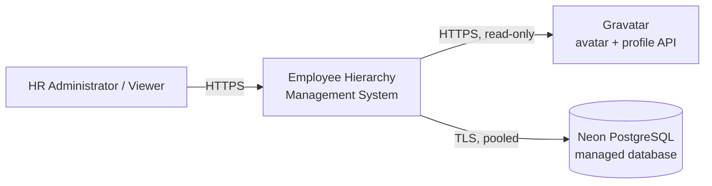
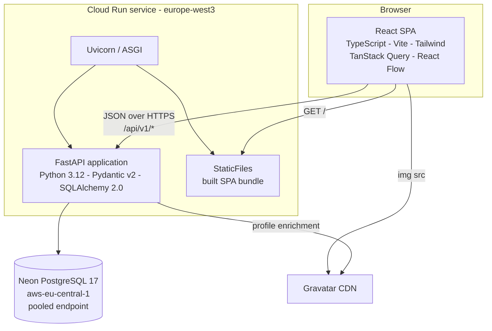
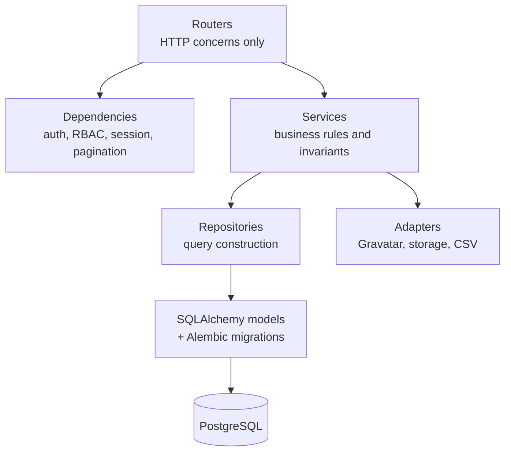
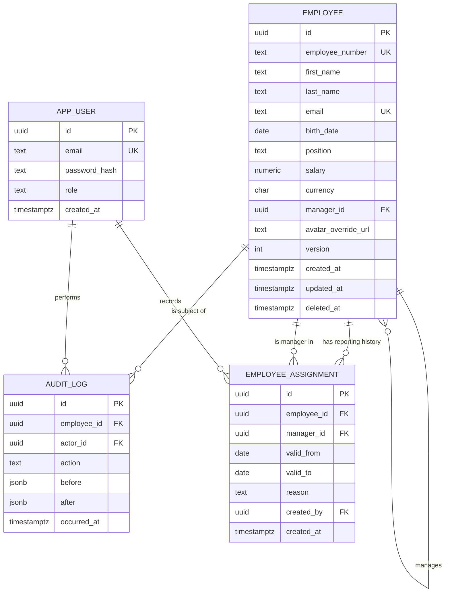

# Employee Hierarchy Management System
## Technical Design Document

| | |
|---|---|
| **Prepared for** | EPI-USE Africa - Technical Services Internship Assessment |
| **Author** | Michael Koch |
| **Version** | 1.1 |
| **Date** | <submission date> |
| **Live application** | <https://...run.app> |
| **API documentation** | <https://...run.app/docs> (interactive OpenAPI) |
| **Source repository** | <https://github.com/...> |
| **Container image** | <europe-west3-docker.pkg.dev/...> |
| **Demo credentials** | Admin: <...> - Read-only: <...> |

> Placeholders marked <...> must be filled before submission.

---

## 1. Executive summary

This document describes the design of a cloud-hosted web application that manages EPI-USE Africa's employee records and reporting hierarchy.

The system is a **single-page React application served by a containerised Python API over a managed PostgreSQL database**. It provides full CRUD over employee records, an interactive and searchable organisational chart, a sortable and filterable reporting table, and Gravatar-based avatars. Beyond the brief it adds role-based access control with salary confidentiality, a full audit trail, CSV import/export, and organisational analytics.

Three decisions shape the design, and the rest of this document justifies them:

1. **PostgreSQL with an adjacency-list hierarchy and recursive CTEs.** The reporting structure is a rooted forest, and the hard part is not storing it but keeping it *provably acyclic* under concurrent edits. A relational database with transactional integrity, declarative constraints and recursive queries solves that directly; a document store does not.
2. **An explicit, versioned, self-documenting HTTP API.** The API is a first-class deliverable rather than an implementation detail of the UI. It is generated as an OpenAPI 3.1 specification from the same type definitions that validate requests at runtime, so the contract cannot drift from the code.
3. **One container as the unit of deployment.** The same image runs on a developer laptop, in CI, and in production on Google Cloud Run. There is no environment-specific packaging step, and therefore no class of bug that appears only in production.

---

## 2. Requirements

### 2.1 Functional requirements

| ID | Requirement | Source |
|---|---|---|
| FR-1 | Create, read, update and delete employee records | Brief |
| FR-2 | Record name, surname, birth date, employee number, salary, role/position and reporting line manager | Brief |
| FR-3 | Set and change an employee's reporting line manager | Brief |
| FR-4 | An employee may not be their own manager | Brief |
| FR-5 | An employee may have no manager (e.g. the CEO) | Brief |
| FR-6 | Present the hierarchy as a visual tree or graph | Brief |
| FR-7 | Search the hierarchy to find, edit or delete an employee | Brief |
| FR-8 | Provide a table/list view sortable and filterable on any employee field | Brief |
| FR-9 | Display Gravatar avatars linked to employee data | Brief |
| FR-10 | Optionally support avatar upload | Brief (nice-to-have) |
| FR-11 | Prevent indirect reporting cycles (A -> B -> C -> A) | Derived from FR-4 |
| FR-12 | Define deletion behaviour for an employee who has direct reports | Derived from FR-1 |
| FR-13 | Role-based access with salary visibility restricted to authorised roles | Added |
| FR-14 | Audit trail of all data changes | Added |
| FR-15 | Bulk CSV/Excel import with validation, and full data export | Added |
| FR-16 | Organisational analytics (headcount, cost roll-up, span of control) | Added |
| FR-17 | Effective-dated reporting lines: view the organisation as at any date, and schedule a change to take effect on a future date | Added |
| FR-18 | Costed preview of a branch move before it is committed | Added |

### 2.2 Non-functional requirements

| ID | Requirement | Target |
|---|---|---|
| NFR-1 | Publicly reachable over HTTPS from a single URL | 100% of assessment window |
| NFR-2 | All state persisted in a remote database; no hardcoded or file-based data | Absolute constraint |
| NFR-3 | Read latency for hierarchy and list views | p95 < 400 ms at 1 000 employees |
| NFR-4 | Hierarchy remains acyclic under concurrent writes | Enforced at database level |
| NFR-5 | Salary values never returned to unauthorised principals | Enforced server-side |
| NFR-6 | Automated test coverage on domain and service layers | >= 80% |
| NFR-7 | Reproducible builds and one-command local startup | `docker compose up` |
| NFR-8 | WCAG 2.1 AA for keyboard navigation and contrast | Audited via Lighthouse/axe |
| NFR-9 | Alignment with POPIA principles for personal information | Documented in section 9.5 |

### 2.3 Requirements traceability

| Requirement | Implemented by | Verified by |
|---|---|---|
| FR-1, FR-2 | `EmployeeService`, `/api/v1/employees` | `test_audit_trail.py` (create, update, soft delete, restore), `test_optimistic_lock.py`, `test_api_contract.py` |
| FR-3 | `PUT /employees/{id}/manager`, `AssignmentService.reassign` | `test_effective_dating_api.py`, `test_cycle_prevention.py` |
| FR-4 | `CHECK (manager_id IS DISTINCT FROM id)` | `test_cycle_prevention.py::test_self_assignment_rejected` |
| FR-5 | Nullable `manager_id`; `GET /hierarchy/roots` | `test_hierarchy_roots.py`, `test_cycle_prevention.py::test_reassignment_to_null_succeeds` |
| FR-6 | `OrgChartPage` (React Flow + Dagre), with `OrgChartNestedList` as the keyboard-navigable equivalent | `useOrgChartData.test.tsx`; the chart interactions themselves are verified manually - there is no browser suite (section 11) |
| FR-7 | `GET /search`, command palette, chart focus mode | `test_search.py` |
| FR-8 | `GET /employees` with whitelisted sort/filter params | `test_filter_ranges.py`, `test_filter_managers.py`, `test_positions.py`, `test_api_contract.py` |
| FR-9 | `core/avatars.py` and `adapters/gravatar.py` (SHA-256 email hash) | `test_gravatar.py` |
| FR-10 | `PUT`/`DELETE /employees/{id}/avatar` and `/profile/avatar`; Pillow re-encode to WebP (section 8.3) | `test_avatars.py` |
| FR-11 | Deferred constraint trigger + service pre-check; `AssignmentService._assert_acyclic` extends this across future boundary dates (section 5.2) | `test_cycle_prevention.py`, `test_effective_dating.py::test_temporal_cycle_across_a_scheduled_change` |
| FR-12 | `DeletionPolicy` strategy | `test_deletion_policies.py` |
| FR-13 | RBAC dependency + response schema selection | `test_api_contract.py`, `test_auth.py` |
| FR-14 | `AuditLog` written inside the unit of work | `test_audit_trail.py`, `test_audit_feed.py` |
| FR-15 | `POST /imports/employees`, `GET /exports/employees.csv` | `test_import.py`, `test_export.py` |
| FR-16 | `AnalyticsService`, `GET /analytics/org-summary`, `GET /analytics/branch/{id}` - `cost` field-gated to `hr_admin` (section 9.3), not endpoint-gated | `test_analytics.py` |
| FR-17 | `employee_assignment` with a GiST exclusion constraint; `AssignmentRepository` as-of CTE; `?as_of=` on the four hierarchy reads; `AsOfControl` and the read-only banner in the web client | `test_effective_dating.py`, `test_effective_dating_api.py`, `asOfQueryKeys.test.ts`, `AsOfBanner.test.tsx` |
| FR-18 | `AssignmentService.preview_move`, `POST /employees/{id}/move-preview` - `cost_delta` field-gated to `hr_admin` (section 9.3) | `test_effective_dating.py::test_preview_writes_nothing`, `test_effective_dating_api.py::test_move_preview_hides_cost_from_a_viewer`, `test_move_preview_locking.py` |

---

## 3. Architecture

### 3.1 Architectural style

The solution is a **client-server application composed of a single-page application and a stateless HTTP API over a managed relational database**. Internally the API is a **layered modular monolith**: a single deployable unit whose modules (employees, hierarchy, auth, audit, analytics, import/export) are separated by explicit interfaces rather than by network boundaries. The SPA and the API ship together in **one container image**.

It is worth being precise about what this architecture is *not*, because these labels are commonly misapplied:

- **Not microservices.** There is one deployable service with one database schema and one transactional boundary. Splitting it would introduce distributed-transaction problems for an invariant (acyclicity) that must be enforced atomically.
- **Not event-driven.** Communication is synchronous request/response. The optional outbound webhooks (section 10.7) are a notification mechanism layered on top of synchronous writes, not an event-sourced or message-brokered core.
- **Not serverless in the functions-as-a-service sense.** The application is an ordinary long-lived ASGI process in a container. Cloud Run is a managed container platform that happens to scale to zero - it executes the same image `docker run` would. The distinction matters: the application is written against no platform-specific handler API, so moving it to ECS, Kubernetes or a plain virtual machine is a configuration change rather than a rewrite.

This choice is deliberate. For a bounded domain with a single strong consistency requirement and a one-week delivery window, a modular monolith gives the strongest correctness guarantees at the lowest operational cost. The module boundaries are drawn so that extraction into separate services remains possible if the domain later warranted it.

### 3.2 System context



### 3.3 Container view

A single Cloud Run service serves both the API and the built SPA. This removes cross-origin requests entirely in production, removes a second deployment pipeline, and means the application has exactly one public URL.



**Route precedence inside the container.** The API mounts first and the static bundle acts as the fallback, so ordering is explicit rather than incidental:

1. `/api/v1/*` -> API routers
2. `/docs`, `/redoc`, `/openapi.json` -> generated documentation
3. `/assets/*` -> hashed, immutable static assets
4. anything else -> `index.html`, so client-side routes such as `/employees/018f...` survive a page refresh

### 3.4 API component view



**Layer responsibilities and rules:**

| Layer | Responsibility | May not |
|---|---|---|
| Router | Parse and validate HTTP input, select response schema, map domain exceptions to status codes | Contain business rules or touch the session directly |
| Dependency | Authenticate, authorise, open the unit of work, parse pagination | Perform writes |
| Service | Enforce invariants, orchestrate transactions, emit audit records | Know about HTTP |
| Repository | Build and execute queries, return domain objects | Enforce business rules |
| Adapter | Wrap external systems behind a narrow port | Leak vendor types upward |

The one-directional dependency rule means the domain and service layers are testable without a web server, and the Gravatar integration is replaceable with a fake in tests.

### 3.5 Request lifecycle - reassigning a manager

1. The user drags an employee card onto a new manager in the org chart.
2. The SPA optimistically updates its cache and issues `PUT /api/v1/employees/{id}/manager` with `If-Match: "<version>"`.
3. A FastAPI dependency validates the JWT and asserts the `hr_admin` role.
4. A second dependency checks a connection out of the pool and begins a transaction.
5. `AssignmentService.reassign` locks the employee and the proposed manager (`SELECT ... FOR UPDATE`, in id order so two conflicting moves cannot deadlock), checks the optimistic-lock version, then runs the subtree query of section 4.6 - at the effective date and at every later boundary date - to confirm the proposed manager is not a descendant on any of them (section 5.2).
6. The update is applied and an `audit_log` row is written in the same transaction.
7. The deferred acyclicity trigger re-validates at `COMMIT`, closing the race window described in section 5.2.
8. The router returns `200 OK` with the new version; on conflict it returns `409` and the SPA rolls the optimistic update back and refetches.

---

## 4. Data design

### 4.1 Domain model

The domain has one aggregate root, `Employee`, which owns its identity, personal data, remuneration and its single reporting edge. The organisation as a whole is a **rooted forest**: every employee has at most one manager, and one or more employees have none.

Deliberate modelling choices:

- **Position is a string field, not a separate `Role` entity.** The brief asks for a role/position on the employee record. Normalising it into a table would add a join and a management screen for no requirement. This is noted as a roadmap item (section 15) rather than pretended away.
- **`employee_number` is a natural key but not the primary key.** It is business-assigned, human-visible and potentially re-sequenced. A surrogate UUID primary key keeps foreign keys stable if numbering policy changes.
- **A random UUID primary key, defaulted in the database.** Ids come from `gen_random_uuid()` (UUIDv4), so an id is never guessable from another one and a client cannot mint its own. The accepted cost is that random keys insert in no particular order and so scatter across the primary-key B-tree; at an organisational scale of thousands of rows that is immaterial. Time-ordered UUIDv7 would recover that locality and is the change to make if insert volume ever justified it.

### 4.2 Entity-relationship diagram



### 4.3 Choosing a hierarchy representation

This is the central data-design decision, so the alternatives are set out in full.

| Option | Read cost | Write cost | Integrity | Verdict |
|---|---|---|---|---|
| **Adjacency list + recursive CTE** | One recursive query per subtree | O(1) - update one column | Self-reference prevented declaratively; cycles prevented by trigger | **Selected** |
| Materialised path (`/ceo/cto/eng/`) | Very fast prefix scan | O(subtree) - rewrite every descendant path | Cycles impossible by construction, but paths can desynchronise | Rejected |
| Closure table (ancestor/descendant pairs) | Fastest - single indexed join | O(ancestors x descendants) rows rewritten per move | Strong, but duplicated state to keep consistent | Rejected at this scale |
| `ltree` extension | Fast, with operators and GiST indexing | Same rewrite cost as materialised path | Good, but extension-dependent | Rejected |
| Graph database (Neo4j) | Excellent traversal | Good | Excellent for traversal; weak for the tabular reporting view | Rejected |

**Rationale.** The workload is write-light and read-moderate at an organisational scale measured in thousands, not millions. Recursive CTEs in PostgreSQL resolve a 5 000-node subtree in single-digit milliseconds with an index on `manager_id`. Every alternative buys read speed the system does not need by paying in derived state that can drift from the truth - and drift is precisely the failure mode this domain cannot tolerate. The adjacency list keeps exactly one authoritative representation of the reporting edge.

The graph database deserves a word, because a reporting structure is a natural graph. It was rejected because the structure here is the *simple* case of a graph - a single-parent forest - which relational databases handle natively, while the brief's tabular reporting, sorting and filtering requirements are where relational databases are strongest and graph databases weakest. Adopting Neo4j would optimise the easy half of the problem and complicate the hard half.

If the system later needed sub-millisecond ancestor lookups across a million rows, the migration path is to add a closure table as a derived read model maintained by trigger, leaving the adjacency list authoritative.

#### The reporting edge is date-bounded

The adjacency list above answers "who reports to whom **now**". `employee_assignment` answers it for any date: one row per run of time during which an employee reported to a particular manager, with a half-open `[valid_from, valid_to)` interval. `valid_to` is the first day the assignment is *no longer* in force, so a run ending 2026-09-30 and one starting 2026-09-30 are adjacent rather than overlapping. That convention is used without exception, in the schema, the queries and the tests.

**The non-overlap invariant is structural, not defensive.** A GiST exclusion constraint makes two managers on the same day unrepresentable:

```sql
ALTER TABLE employee_assignment
  ADD CONSTRAINT assignment_no_overlap
  EXCLUDE USING gist (
      employee_id WITH =,
      daterange(valid_from, valid_to, '[)') WITH &&
  );
```

This is the same argument as section 5.2 applied to time rather than to shape: application-level "does this overlap anything?" checks are correct in isolation and wrong under concurrency, whereas the constraint holds no matter how many instances write at once.

**Why `employee.manager_id` was kept.** The column is now a *cache* of whichever assignment run is effective today, not an independent fact. It was retained rather than deleted for three reasons: every existing query, index and the deferred cycle trigger keep working untouched; the present-day read path stays a single indexed column rather than a range predicate; and a full temporal rewrite would have put the whole existing test suite at risk for no behavioural gain.

A cache is only defensible if something keeps it honest, so nothing updates it by hand. `sync_effective_assignments()` recomputes it from whatever is in force today:

```sql
UPDATE employee e
   SET manager_id = ef.manager_id,
       version    = e.version + 1,
       updated_at = now()
  FROM effective ef
 WHERE e.id = ef.employee_id
   AND e.deleted_at IS NULL
   AND e.manager_id IS DISTINCT FROM ef.manager_id;
```

It runs once per write transaction and once at application startup. **This is what makes a future-dated assignment become current on its own date with no scheduler, no cron and no background worker** - the change is already in the table, and the first transaction on or after its date simply observes it. `version` is bumped alongside `manager_id` because that column backs the `If-Match` ETag (section 5.4): a manager that changed silently under a stale ETag would let a client overwrite a decision it never saw.

The function is a single indexed `UPDATE ... FROM` that matches zero rows on the overwhelming majority of calls, so the cost of never letting the cache drift is negligible.

**Limits of the model.** The *edge* is temporal, and so is the end of the lifecycle: `deleted_at` is compared against the as-of date, so an employee deleted today is absent from today's tree and still present in yesterday's. The start is not, because the employee row carries no hire date - `created_at` records when the row was written, which for an imported roster is the import, not the joining. An employee created today therefore reads as present at every earlier date. Closing that gap means a hire date and full validity intervals on the employee row; the departure half is what the org-chart-as-at-a-date question actually turns on, since deletions are the change most likely to be mistaken for the feature being broken.

### 4.4 Schema

```sql
CREATE TABLE employee (
    id                  UUID PRIMARY KEY,
    employee_number     TEXT        NOT NULL,
    first_name          TEXT        NOT NULL,
    last_name           TEXT        NOT NULL,
    email               TEXT        NOT NULL,
    birth_date          DATE        NOT NULL,
    position            TEXT        NOT NULL,
    salary              NUMERIC(12,2) NOT NULL,
    currency            CHAR(3)     NOT NULL DEFAULT 'ZAR',
    manager_id          UUID        REFERENCES employee(id) ON DELETE SET NULL,
    avatar_override_url TEXT,
    version             INTEGER     NOT NULL DEFAULT 1,
    created_at          TIMESTAMPTZ NOT NULL DEFAULT now(),
    updated_at          TIMESTAMPTZ NOT NULL DEFAULT now(),
    deleted_at          TIMESTAMPTZ,

    CONSTRAINT employee_not_own_manager CHECK (manager_id IS DISTINCT FROM id),
    CONSTRAINT employee_salary_non_negative CHECK (salary >= 0),
    CONSTRAINT employee_birth_date_sane CHECK (birth_date > DATE '1900-01-01')
);

CREATE UNIQUE INDEX uq_employee_number ON employee (employee_number)
    WHERE deleted_at IS NULL;
CREATE UNIQUE INDEX uq_employee_email  ON employee (lower(email))
    WHERE deleted_at IS NULL;
CREATE INDEX ix_employee_manager       ON employee (manager_id)
    WHERE deleted_at IS NULL;
CREATE INDEX ix_employee_name_trgm     ON employee
    USING GIN ((first_name || ' ' || last_name) gin_trgm_ops);
```

Three details worth noting:

- **`IS DISTINCT FROM` rather than `<>`.** A plain `manager_id <> id` evaluates to `NULL` when `manager_id` is `NULL`, and a `CHECK` constraint passes on `NULL`. It would work by accident here, but `IS DISTINCT FROM` states the intent unambiguously and is correct for all inputs.
- **Birth date "not in the future" is enforced in the application, not the schema.** `CURRENT_DATE` is not immutable; embedding it in a `CHECK` constraint produces a predicate whose truth changes over time, which can make a valid backup impossible to restore. The schema constrains only what is time-invariant; the temporal rule lives in the Pydantic validator, where it is also testable.
- **Partial unique indexes** (`WHERE deleted_at IS NULL`) allow an employee number to be reused after a soft delete without weakening uniqueness among active records.

### 4.5 Soft deletion

Employee records are soft-deleted by default (`deleted_at` set) rather than physically removed. Personnel data has audit and compliance value, accidental deletion in a hierarchy is destructive, and a restore path is cheap to provide. There is deliberately **no hard-delete endpoint**: erasure removes the very audit rows that make the rest of the trail trustworthy, so it is handled out-of-band against the database rather than exposed as a route anyone can reach with a stale tab open (section 9.5).

### 4.6 Key queries

**Full subtree with depth, and a defensive cycle guard:**

```sql
WITH RECURSIVE subtree AS (
    SELECT e.*, 0 AS depth, ARRAY[e.id] AS path
    FROM employee e
    WHERE e.id = :root_id AND e.deleted_at IS NULL
  UNION ALL
    SELECT c.*, s.depth + 1, s.path || c.id
    FROM employee c
    JOIN subtree s ON c.manager_id = s.id
    WHERE c.deleted_at IS NULL
      AND NOT c.id = ANY(s.path)          -- terminates even on corrupt data
)
SELECT * FROM subtree ORDER BY depth, last_name;
```

**Reporting-line (ancestor chain) for breadcrumbs and chart focus mode:**

```sql
WITH RECURSIVE line AS (
    SELECT e.id, e.manager_id, 0 AS level
    FROM employee e
    WHERE e.id = :employee_id AND e.deleted_at IS NULL
  UNION ALL
    SELECT m.id, m.manager_id, l.level + 1
    FROM employee m JOIN line l ON m.id = l.manager_id
    WHERE m.deleted_at IS NULL AND l.level < :max_level
)
SELECT e.*, line.level AS depth
FROM line JOIN employee e ON e.id = line.id
WHERE line.level > 0
ORDER BY line.level;
```

**Cycle safety check before reassignment** - the proposed manager must not be inside the employee's own subtree:

```sql
WITH RECURSIVE subtree AS (
    SELECT id, 0 AS depth, ARRAY[id] AS path
    FROM employee WHERE id = :of_id
  UNION ALL
    SELECT c.id, s.depth + 1, s.path || c.id
    FROM employee c JOIN subtree s ON c.manager_id = s.id
    WHERE NOT c.id = ANY(s.path)
      AND s.depth < :max_depth
)
SELECT EXISTS (
    SELECT 1 FROM subtree WHERE id = :candidate_id
) AS is_descendant;
```

**Cost and headcount roll-up for any branch** (powers the analytics panel):

```sql
SELECT count(*) AS headcount,
       sum(salary) AS total_annual_cost,
       round(avg(salary), 2) AS average_salary,
       max(depth) AS depth_below
FROM subtree;
```

---

## 5. Business rules and invariants

### 5.1 The invariants

| # | Invariant | Enforcement |
|---|---|---|
| I-1 | An employee is never their own manager | `CHECK` constraint (database) |
| I-2 | The reporting structure contains no cycles of any length | Deferred constraint trigger + service pre-check |
| I-3 | A manager reference always points to an existing, non-deleted employee | Foreign key + partial index |
| I-4 | Employee number and email are unique among active employees | Partial unique indexes |
| I-5 | Concurrent edits cannot silently overwrite one another | Optimistic lock on `version` |
| I-6 | Every mutation is attributable to a principal and a timestamp | Audit write inside the same transaction |

### 5.2 Cycle prevention, and why the obvious approach is not enough

The naive implementation checks "is the new manager inside this employee's subtree?" in application code and then writes. That check is correct in isolation and **wrong under concurrency**. Two simultaneous reassignments - A moved under B, and B moved under A - can each pass their own check against a snapshot that predates the other, and commit a cycle that neither request could have created alone.

An autoscaling platform heightens this risk rather than reducing it: Cloud Run may run several instances of the application at once, so two conflicting requests can genuinely execute in separate processes. Any lock held in application memory is therefore worthless, and the invariant must be enforced by the database.

Three layers address this:

1. **Row-level locking.** The service takes `SELECT ... FOR UPDATE` on the employee and the proposed manager before validating, serialising conflicting moves on the same rows regardless of which instance handles them.
2. **A deferred constraint trigger.** Validation is re-run at `COMMIT`, after all statements in the transaction have been applied, so a cycle assembled from several statements is still caught.
3. **A defensive path guard in every recursive read** (`NOT id = ANY(path)`), so that even if corrupt data somehow existed, reads terminate rather than looping.

```sql
CREATE OR REPLACE FUNCTION assert_no_reporting_cycle() RETURNS trigger AS $$
DECLARE
    cursor_id UUID := NEW.manager_id;
    hops      INT  := 0;
BEGIN
    WHILE cursor_id IS NOT NULL LOOP
        IF cursor_id = NEW.id THEN
            RAISE EXCEPTION 'Reporting cycle detected for employee %', NEW.id
                USING ERRCODE = 'check_violation';
        END IF;
        SELECT manager_id INTO cursor_id FROM employee WHERE id = cursor_id;
        hops := hops + 1;
        IF hops > 1000 THEN
            RAISE EXCEPTION 'Reporting chain exceeds maximum supported depth';
        END IF;
    END LOOP;
    RETURN NEW;
END;
$$ LANGUAGE plpgsql;

CREATE CONSTRAINT TRIGGER employee_no_cycle
    AFTER INSERT OR UPDATE OF manager_id ON employee
    DEFERRABLE INITIALLY DEFERRED
    FOR EACH ROW EXECUTE FUNCTION assert_no_reporting_cycle();
```

The service-layer pre-check is not redundant with the trigger: it exists to return a clear, actionable `422` naming the offending employee, rather than surfacing a database exception to the user.

#### Cycle validation has to be temporal too

Both the `CHECK` constraint and the deferred trigger guard the `employee` table, and `employee.manager_id` only ever holds the edge in force **today**. Neither can see a change that has not taken effect yet. Once reporting lines can be scheduled, that leaves a real gap: a move can be perfectly acyclic on the day it takes effect and still close a loop later, when some other scheduled change lands.

Concretely - schedule B under A from 1 October, then attempt to move A under B effective 1 September. On 1 September the structure is a tree and a point-in-time check passes it. On 1 October the two edges meet and the structure is cyclic.

The set of dates on which the structure can change is finite: the distinct `valid_from` and `valid_to` values after the effective date. So the move is validated against every one of them.

```python
dates = [effective_from, *repo.get_boundary_dates(after=effective_from)]
for at in dates:
    if repo.is_descendant(new_manager_id, of_id=employee_id, as_of=at):
        raise ReportingCycleError(chain=repo.get_ancestors(new_manager_id, as_of=at), at=at)
```

Checking the structure *before* the move is sufficient rather than merely convenient: the only new edge is employee -> new manager, and a cycle can run through it only if the new manager is already inside the employee's subtree on that date. The move cannot add anyone to that subtree.

**The cost is proportional to how far back the move is dated.** For a move taking effect today or later - the ordinary case - the only boundaries ahead of it are genuinely scheduled changes, so the set is a handful of dates and validation is a handful of queries. A *backdated correction* has to check every boundary between its effective date and the end of the schedule, which in an organisation with a long reassignment history can be a hundred or more dates, each one a separate recursive query. That is correct but not cheap, and it is the reason a deep backdated correction is noticeably slower than a normal move. Batching those checks into a single query over all candidate dates is the optimisation if it ever matters; it has not been needed at this scale.

This is a fourth layer on top of the three above, and the only one that looks forward. `test_temporal_cycle_across_a_scheduled_change` is the test that pins it; reducing the date set to `[effective_from]` alone makes that test fail and every other test in the suite still pass, which is the clearest statement of what it is protecting.

### 5.3 Deleting an employee who has direct reports

The brief does not specify what happens to an employee's reports when that employee is removed, which makes it a design decision rather than an omission. Three policies are implemented behind a **strategy interface**, selected per request:

| Policy | Behaviour | Default for |
|---|---|---|
| `reparent` | Direct reports are reassigned to the deleted employee's manager | Ordinary departures - preserves the chain |
| `promote_to_root` | Direct reports become managerless and appear as new roots | Removing a root, or restructuring |
| `cascade` | The entire subtree is soft-deleted | Closing a whole department |

The UI never applies `cascade` silently: it requests a preview first, showing the exact count and names of affected employees, and requires explicit confirmation. Deleting a root with `reparent` degrades gracefully to `promote_to_root`, since there is no grandparent to reparent to.

### 5.4 Concurrency control

Every write carries the record's `version`, supplied as an `If-Match` header. A mismatch returns `409 Conflict` as a problem document naming both the expected and the actual version, so the UI can tell the user their copy is stale and send them back to a freshly read record rather than silently discarding one user's work. The payload carries the versions, not the two representations; reconciling them is a refetch. Pessimistic locking was rejected: lock lifetime across a human editing session is unbounded, and conflicts in this domain are rare enough that optimistic control is the better trade.

---

## 6. API design

### 6.1 Principles

Resource-oriented, versioned under `/api/v1`, JSON only, no verbs in paths. State-changing operations that carry their own business rules get a dedicated sub-resource rather than being folded into a general `PATCH`, because their authorisation, validation and audit semantics differ.

### 6.2 Endpoints

| Method | Path | Purpose | Role |
|---|---|---|---|
| `POST` | `/auth/login` | Exchange credentials for access + refresh tokens | Public |
| `POST` | `/auth/refresh` | Rotate refresh token | Authenticated |
| `POST` | `/auth/logout` | Revoke the presented refresh token | Authenticated |
| `GET` | `/auth/me` | Current principal and capability flags | Authenticated |
| `GET` | `/employees` | Paginated list; sort, filter, free-text search | Viewer |
| `POST` | `/employees` | Create employee | Admin |
| `GET` | `/employees/positions` | Distinct job titles in use, for the filter list | Viewer |
| `GET` | `/employees/managers` | Distinct managers the *currently filtered* employees report to, for the "Reports to" filter | Viewer (salary filters gated to Admin, section 9.3) |
| `GET` | `/employees/gravatar-prefill` | Public Gravatar profile for an address, to prefill the create form | Admin |
| `GET` | `/employees/{id}` | Single employee record | Viewer |
| `PATCH` | `/employees/{id}` | Partial update (optimistic lock) | Admin |
| `DELETE` | `/employees/{id}` | Soft delete with `?policy=` | Admin |
| `POST` | `/employees/{id}/restore` | Undo a soft delete | Admin |
| `GET` | `/employees/{id}/deletion-preview` | Affected records for a given policy | Admin |
| `PUT` | `/employees/{id}/manager` | Reassign reporting line; optional `effective_from` and `reason` schedule it (optimistic lock) | Admin |
| `POST` | `/employees/{id}/move-preview` | Costed preview of a branch move; writes nothing | Viewer (`cost_delta` field-gated to Admin, section 9.3) |
| `GET` | `/employees/{id}/assignment-history` | Every reporting run for one employee, newest first | Viewer |
| `GET` | `/employees/{id}/subtree` | Descendants to `?depth=`, as at `?as_of=` | Viewer |
| `GET` | `/employees/{id}/reporting-line` | Ancestor chain to the root, as at `?as_of=` | Viewer |
| `GET` | `/employees/{id}/audit` | Change history for one employee | Viewer (`salary` values field-gated to Admin, section 9.3) |
| `PUT` | `/employees/{id}/avatar` | Upload a photo for an employee (optimistic lock) | Admin |
| `DELETE` | `/employees/{id}/avatar` | Drop the uploaded photo, falling back to Gravatar | Admin |
| `GET` | `/hierarchy/roots` | Employees with no manager, as at `?as_of=` | Viewer |
| `GET` | `/hierarchy/tree` | Chart-shaped payload, lazily expandable, as at `?as_of=` | Viewer |
| `GET` | `/hierarchy/scheduled` | Every future-dated assignment not yet in force | Viewer |
| `DELETE` | `/hierarchy/scheduled/{id}` | Cancel a scheduled change and reopen the run it would have superseded | Admin |
| `GET` | `/hierarchy/diff?from=&to=` | What changed in the structure between two dates | Viewer (`cost` field-gated to Admin, section 9.3) |
| `GET` | `/analytics/org-summary` | Headcount, depth, span-of-control, anomalies | Viewer |
| `GET` | `/analytics/branch/{id}` | Cost and headcount roll-up for a branch | Viewer (`cost` field-gated to Admin, section 9.3) |
| `POST` | `/imports/employees` | CSV/XLSX upload; `?dry_run=true` validates only | Admin |
| `GET` | `/exports/employees.csv` | Full extract honouring current filters | Viewer |
| `GET` | `/search` | Cross-entity quick search for the command palette | Viewer |
| `GET` | `/audit` | Global change-history feed across every employee | Viewer (`salary` values field-gated to Admin, section 9.3) |
| `GET` | `/profile` | Signed-in user, their avatar sources and their own employee record | Authenticated |
| `PUT` | `/profile/avatar` | Upload the signed-in user's own photo | Authenticated |
| `DELETE` | `/profile/avatar` | Drop the signed-in user's own photo | Authenticated |
| `GET` | `/avatars/{id}` | Serve a stored avatar image (section 8.3) | Public |
| `GET` | `/health` | Liveness and database reachability | Public |

The four hierarchy reads take an optional `as_of` date, defaulting to today, and **echo the resolved date back in every response** so a client never has to infer which day a payload describes. `PUT /employees/{id}/manager` returns the resulting assignment along with any scheduled changes the decision superseded, so a caller is never told silently that someone else's plan was cancelled.

### 6.3 List query contract

```
GET /api/v1/employees
    ?q=jansen                      # trigram-backed match on first + last name
    &position=Integration+Architect
    &manager_id=<uuid>
    &min_salary=450000&max_salary=900000
    &sort=last_name&order=asc      # sort field validated against an allow-list
    &page=1&page_size=50
```

`/employees/managers` takes the same filter parameters as the list and answers them about the same set - both build their `WHERE` from one shared `filter_conditions`, so the managers offered are exactly the managers of the rows you are looking at. It ignores `manager_id`, since the caller is choosing what to set it to.

`q` on the list matches the full name only; the command palette's `/search` is the endpoint that also looks at position and employee number, because a table filter and a jump-to-person box want different recall. `sort` is resolved against a static map of permitted column names. Dynamic `ORDER BY` built from raw user input is the classic injection vector that parameterised queries do **not** protect against, because identifiers cannot be bound as parameters. Sorting and filtering are performed in the database, not in the browser, so the table view remains correct and fast when the dataset outgrows a single page.

### 6.4 Error model

All errors return `application/problem+json` per RFC 9457:

```json
{
  "type": "https://<host>/errors/reporting-cycle",
  "title": "Reassignment would create a reporting cycle",
  "status": 422,
  "detail": "Thandi Mokoena reports to Michael Koch indirectly and cannot become his manager.",
  "instance": "/api/v1/employees/018f.../manager",
  "errors": [{ "field": "manager_id", "code": "cycle_detected" }]
}
```

A single exception-handler layer maps domain exceptions to problem documents, so routers contain no error-formatting logic and messages stay consistent.

### 6.5 Contract documentation

FastAPI derives an OpenAPI 3.1 document from the same Pydantic models used for runtime validation, so the published contract cannot drift from the implementation. Swagger UI is served at `/docs`, ReDoc at `/redoc` and the raw document at `/openapi.json` - **in every environment except production**, where all three are switched off, since an interactive console over a live HR database is not something to leave reachable. To browse them, run the service with `ENVIRONMENT` set to anything other than `production`.

The same document is the source for the SPA's request and response types: `npm run generate:api-types` regenerates `web/src/lib/api-types.ts` from the live schema, so a contract change that the frontend has not caught up with is a TypeScript error rather than a runtime surprise.

---

## 7. Frontend design

### 7.1 Structure

```
src/
  app/            routing, providers, the authenticated shell
  features/
    employees/    list view, detail drawer, forms
    hierarchy/    org chart, node renderers, layout
    analytics/    summary cards, distributions
    auth/         login, session, capability gates
  components/ui/  shadcn/ui primitives
  lib/            generated API client, hooks, formatters
```

Feature-first rather than type-first: everything needed to change the org chart lives in one directory, which keeps the module boundaries in the UI aligned with those in the API.

The SPA is built with Vite and the resulting bundle is copied into the API image at build time (section 10.3), so the frontend is deployed as part of the same artefact and can never be a version behind the API it talks to.

### 7.2 State management

Server state and client state are handled separately, which avoids the most common source of accidental complexity in data-heavy UIs.

- **Server state - TanStack Query.** Caching, deduplication, background refetch, optimistic updates and rollback are solved rather than reimplemented. Query keys are derived from the filter object, so changing a filter is a cache lookup rather than a manual refetch.
- **Client state - React state and URL search params.** Filters, sort order and the selected employee live in the URL, which makes every view shareable and bookmarkable and gives back/forward navigation for free.
- **A global store was deliberately not introduced.** Redux or Zustand would add a layer whose primary job - caching server data - is already covered.

### 7.3 Rendering the hierarchy

**React Flow with a Dagre layout pass** was selected over hand-rolled D3 and over off-the-shelf org-chart libraries. React Flow supplies pan, zoom, minimap, viewport virtualisation and drag interaction; Dagre computes a deterministic layered tree layout; node rendering stays as ordinary React components, so an employee card in the chart reuses the same avatar and badge components as the table view.

Behaviour at scale:

- The chart requests the tree lazily - roots plus two levels initially, then a subtree fetch on expand - so a 5 000-employee organisation does not serialise into a single response.
- **Focus mode** renders an employee's full ancestor chain plus a configurable depth of descendants, which is how people actually read an org chart.
- Searching selects and centres the matching node, expanding collapsed ancestors along the way.
- **Drag-and-drop reassignment**: dropping a card onto another employee issues the reassignment call. Invalid targets - the employee's own descendants - are computed client-side from the loaded subtree and shown as non-droppable *before* the drop, with the server remaining the authority.

### 7.4 Table view

TanStack Table in fully controlled mode, with sorting, filtering and pagination delegated to the server (section 6.3). The column set is built per role by `buildEmployeeColumns(canViewSalary)`, so for a viewer the salary column is never constructed at all rather than hidden client-side - which matches the payload, where the key is equally absent (section 9.3). User-configurable column visibility is not implemented.

### 7.5 Accessibility and responsiveness

Forms and overlays are built on Base UI primitives (`@base-ui/react`) via shadcn/ui, giving correct focus management, labelling and `aria` semantics. The chart, being inherently visual, has an equivalent accessible path: a keyboard-navigable nested-list view of the same hierarchy, which also serves as the print view. Colour is never the sole carrier of meaning. Target: Lighthouse accessibility >= 95 and zero critical axe violations.

---

## 8. Gravatar integration

### 8.1 Avatar resolution

Gravatar identifies users by a hash of their email address. The current specification uses **SHA-256** of the address after trimming whitespace and lower-casing it - MD5 is legacy and is not used here.

```python
def gravatar_url(email: str, size_px: int = 64) -> str:
    size = max(1, min(size_px, MAX_AVATAR_PX))
    digest = hashlib.sha256(email.strip().lower().encode()).hexdigest()
    query = urlencode({"s": size, "d": settings.GRAVATAR_DEFAULT_IMAGE, "r": "pg"})
    return f"https://gravatar.com/avatar/{digest}?{query}"
```

Resolution follows a deterministic fallback chain: an uploaded override, then the Gravatar image, then a generated initials avatar rendered locally. The `d` parameter handles the fallback server-side at Gravatar's CDN, so a missing avatar never produces a broken image.

### 8.2 Design decisions

- **The hash is computed server-side and returned as part of the employee representation.** The browser never needs the raw email to render an avatar, which keeps addresses out of any client-side caching or logging path.
- **Images are requested directly by the browser from Gravatar's CDN**, not proxied. Proxying would put an external dependency in the critical path of every API response and consume container CPU for no benefit.
- **The integration is confined to two modules.** `core/avatars.py` resolves an address to a URL and is pure, so it is tested without a network; `adapters/gravatar.py` is the only code that makes an outbound call, and the profile tests stub its HTTP client so the suite never reaches the internet. Substituting an internal avatar service means replacing those two modules, not touching the services that call them.
- **Requested size is capped and `r=pg` is enforced**, so the application never renders an unrated third-party image in a corporate context.
- **Failures are non-fatal.** Avatar rendering is presentation, never a reason for a request to fail.

### 8.3 Optional upload

Uploaded photos are stored **in PostgreSQL** (`avatar_image`, a `bytea` column) rather than in object storage. The Cloud Run filesystem is ephemeral, the brief requires every modification to be committed to the remote database, and a normalised avatar is only a few tens of kilobytes - so a separate bucket would add a service, credentials and a second failure mode for no real benefit at this scale.

- **Every upload is decoded and re-encoded** (Pillow) to a 512 x 512 centre-cropped WebP. The bytes served back are always an image this code produced, so a file that only *claims* to be an image (an SVG with script, an HTML polyglot) never reaches a browser, and EXIF metadata such as GPS coordinates is dropped. JPEG, PNG, WebP and GIF are accepted, up to 5 MB and 40 megapixels (a decompression-bomb guard); the body is read in capped chunks before any decoding.
- **Serving:** `GET /api/v1/avatars/{id}` is the one unauthenticated read, because an `` tag cannot carry a bearer token. Ids are random UUIDs only ever handed out in authenticated responses - the same exposure as a Gravatar URL. Rows are immutable (a new upload is a new id), so images are served with `Cache-Control: immutable`.
- **Employee photos** (`PUT`/`DELETE /employees/{id}/avatar`, HR admin only) set `avatar_override_url` through the ordinary update path, so a photo change is version-checked with `If-Match` and recorded in the audit trail like any other edit. The replaced image is deleted once nothing references it.
- **Account photos** (`PUT`/`DELETE /profile/avatar`, any signed-in user) use the same storage and the same precedence over Gravatar, via `app_user.avatar_override_url`.

The **profile page** (`GET /api/v1/profile`) shows the signed-in account, its avatar resolution (uploaded photo -> Gravatar -> initials, with a live check of whether a Gravatar exists), its permissions, and the employee record that shares its email address - including that person's manager and direct reports.

### 8.4 Profile enrichment

Gravatar also exposes a public profile API. When an administrator enters an email on the create-employee form, the system looks it up and offers to prefill display name, job title and location, which the administrator can accept or ignore. It is a small feature that demonstrates the integration is understood as a data source rather than only an image URL.

---

## 9. Security and privacy

### 9.1 Authentication

Email and password, with **Argon2id** hashing (memory-hard, and the current OWASP recommendation over bcrypt for new systems). Tokens are signed with HS256 using a secret held in Google Secret Manager and injected at container start; it is never committed to the repository and never baked into the image. The application refuses to start if that secret is absent or shorter than 32 characters, so a misconfigured deployment fails loudly instead of serving traffic with a guessable signing key.

The token pair is deliberately asymmetric:

- **Access tokens** live 15 minutes and are verified *statelessly* - signature, expiry and type, with one lookup to load the current role. Nothing about them can be revoked, which is precisely why they are short.
- **Refresh tokens** live seven days and are verified *statefully*, against a `refresh_token` row named by the token's `jti`. A signature can prove a token was minted here; only server-side state can answer whether it is still meant to work.

That state is what makes rotation more than a word. Each refresh spends the presented token and issues a successor, chained through `replaced_by`. Presenting an **already spent** token means two parties hold the same credential and there is no way to tell which one is calling - so the whole chain is revoked and both are forced back through the password. A stolen refresh token therefore buys an attacker access only until the legitimate client's next refresh, rather than the remainder of the seven days. `POST /auth/logout` revokes the presented token for the same reason: clearing the browser's copy of a credential is not the same as ending the session, and only the second is a security property.

### 9.2 Authorisation

Two roles, kept deliberately minimal:

| Role | Read employees | Read salary | Write | Import | Export | Audit log |
|---|---|---|---|---|---|---|
| `viewer` | Yes | No | No | No | Yes (no salary column) | Yes (salary values stripped) |
| `hr_admin` | Yes | Yes | Yes | Yes | Yes | Yes |

A viewer *can* read the change history. Knowing that a record was edited, by whom and when is an accountability property worth more than the small amount it reveals, and the salary values themselves are removed from those payloads by the same role check that removes them everywhere else - a viewer sees `salary_changed: true`, never the figures. This is a deliberate choice rather than an oversight, and it is recorded here because the two must not drift apart.

Authorisation is a route-level dependency, so an endpoint cannot be added without a policy decision being made explicitly. `tests/test_api_contract.py` enumerates every route and drives it over real HTTP as an anonymous caller, as a forged-token caller and as a viewer, so "this route forgot its policy" is a test failure rather than a code review's responsibility.

### 9.3 Salary confidentiality

Salary is the one field in this dataset with genuine confidentiality weight, and it is handled as a **field-level authorisation** concern rather than a UI concern. The API selects a different response schema by role: for a `viewer` the salary key is **absent from the payload**, not null and not masked. Nothing that reaches an unauthorised client ever contains the value, so no amount of inspecting network traffic reveals it. Salary-based filters and sorts are likewise rejected for viewers, since either would allow the value to be inferred by binary search. That guard (`require_salary_access`) is applied by the CSV export as well as the list endpoint, and for exactly the same reason: the export accepts the identical `min_salary`/`max_salary`/`sort` parameters, so withholding the *column* while still answering "who earns more than X" would leak every figure in a handful of requests. One shared function rather than two copies, so the two endpoints cannot diverge.

### 9.4 Input handling

- All request bodies are parsed and validated by Pydantic models at the boundary; unknown fields are rejected rather than ignored.
- All database access goes through SQLAlchemy with bound parameters. Identifiers that cannot be bound - sort columns - are resolved through an allow-list (section 6.3).
- React escapes rendered content by default; `dangerouslySetInnerHTML` appears nowhere in the codebase.
- Beyond presence and type, the write schemas bound every field: name and position lengths (the columns are `TEXT`, so without this one request can push arbitrary megabytes into a row), a salary ceiling matching `NUMERIC(12, 2)`, a birth date that must be past and after 1900, a three-letter currency, and an avatar URL restricted to absolute `http(s)`. These restate rules the database already enforces so that a bad input is a 422 naming the field rather than an `IntegrityError` surfacing as a 500.
- Uploaded import files are read against a size cap rather than buffered whole, and the parsers bound row and field counts, so a small compressed workbook cannot expand into an out-of-memory condition.
- CSV exports neutralise a leading `=`, `+`, `-`, `@`, tab or carriage return so a crafted employee name cannot execute as a formula in whoever's spreadsheet opens the download (CSV injection, CWE-1236).
- Because the SPA and the API share an origin, CORS is configured with an explicit origin allow-list rather than a wildcard; `*` is rejected at startup, since the API is served with `allow_credentials=True`. In production the list is the deployed origin only; in development it is `localhost`.
- Rate limiting is applied to authentication endpoints to blunt credential stuffing. It keys on the client address as rewritten from `X-Forwarded-For` by uvicorn's `--proxy-headers`; without that the container sees only Cloud Run's ingress address and the limiter would collapse into a single global bucket - useless against one attacker and a denial of service against everyone else.
- Security headers (HSTS, `X-Content-Type-Options`, `X-Frame-Options`, `Referrer-Policy`, `Permissions-Policy` and a restrictive CSP allowing `https:` image sources for Gravatar and avatar overrides) are set by application middleware, so they travel with the container rather than living in platform configuration that a redeployment elsewhere would lose. The CSP matters more than usual here: the access token lives in the SPA's `localStorage`, so it is exactly as reachable as any script the page runs, and `script-src 'self'` is what keeps that set to none.
- The interactive API docs (`/docs`, `/openapi.json`) are served in development only. They enumerate every route, parameter and schema, which is a convenience in development and a reconnaissance aid in production.

### 9.5 POPIA alignment

The system processes personal information of South African data subjects and is designed with the Protection of Personal Information Act's conditions in mind:

| Condition | How it is addressed |
|---|---|
| Minimality | Only fields required by the brief are collected; no ID numbers, addresses or contact numbers |
| Purpose specification | Data is used solely for organisational structure management |
| Security safeguards | Encryption in transit, hashed credentials, role-based access, least-privilege database user, secrets in a managed secret store |
| Accountability | Every change is attributable through the audit log |
| Data subject participation | Records are individually retrievable and correctable through the API. Erasure is a manual database operation rather than an endpoint (section 4.5) - an accepted gap, since a self-service erasure route is the one deletion nothing can undo |

Data residency deserves an explicit note. The managed database is hosted in Frankfurt (section 10.2), so personal information leaves South Africa. POPIA permits cross-border transfer where the recipient jurisdiction affords comparable protection, and the EU regime satisfies that test. A production deployment preferring in-country residency runs the same container unchanged against a PostgreSQL instance in Google's `africa-south1` (Johannesburg) region; the trade-off is cost, since no managed PostgreSQL offering with a free tier exists there today.

This is a design-level alignment, not a compliance certification - a distinction this document states plainly rather than overclaiming.

### 9.6 Audit trail

Every create, update, delete, restore and reassignment writes an `audit_log` row containing the actor, the action, and before/after JSON snapshots, inside the same transaction as the change itself. Either both commit or neither does, so the audit log cannot disagree with the data. It is exposed as a per-employee timeline and as a global feed in the UI.

Both feeds order by `occurred_at DESC, id DESC`. The tiebreaker is load-bearing rather than cosmetic: `occurred_at` defaults to `now()`, which in PostgreSQL is the *transaction* start time, so every row written by one request - a cascade delete, a bulk import - carries a byte-identical timestamp. Ordering on the timestamp alone leaves tied rows in whatever order the executor returns them, and `LIMIT`/`OFFSET` then slices that inconsistently between requests: an entry appears on two pages while another is never shown at all. A unique tiebreaker makes the total order stable, and an index matching that exact ordering keeps the read from scanning a table that only ever grows.

---

## 10. Deployment and operations

### 10.1 Topology

| Component | Platform | Rationale |
|---|---|---|
| Application (SPA + API) | Google Cloud Run - one service, one container image | Runs the same image as local development; scales to zero; HTTPS and a public URL provisioned automatically |
| Container registry | Google Artifact Registry | Versioned, immutable image tags; the deployed artefact is identifiable by digest |
| Database | Neon (serverless PostgreSQL) | Free tier that does not expire; database branching gives a real preview environment per pull request |
| Secrets | Google Secret Manager | Database URL and signing key injected at start; never in the image or the repository |

**Why a container platform rather than a function platform.** Both are "serverless" in the billing sense, but a container platform imposes no handler API, no request-duration ceiling that a large CSV import would hit, and no runtime-specific packaging. The application is a plain ASGI app; the deployment target is an implementation detail. That portability matters more here than any marginal convenience, and it makes the `docker compose up` deliverable and the production deployment the same thing rather than two parallel truths that can quietly diverge.

### 10.2 Regions and co-location

Cloud Run runs in **`europe-west3` (Frankfurt)** and Neon in **`aws-eu-central-1` (Frankfurt)**.

The reasoning is worth stating, because the intuitive choice is wrong. Google operates an `africa-south1` (Johannesburg) region, which would minimise latency between a South African user and the application. But Neon's nearest region is Frankfurt, and a single page view issues several database round trips while the browser issues one. Placing the application in Johannesburg and the database in Frankfurt would multiply an intercontinental hop of roughly 150 ms across every query; co-locating both in Frankfurt pays that hop once, at the network edge, and keeps every database round trip inside one metro.

If in-country residency or minimum user latency became the priority, the deployment moves to `africa-south1` with Cloud SQL for PostgreSQL in the same region. No application code changes - only `DATABASE_URL`. That option is documented rather than taken because Cloud SQL has no free tier.

### 10.3 Container build

A multi-stage Dockerfile produces one image:

```dockerfile
# ---- stage 1: build the SPA
FROM node:22-alpine AS web
WORKDIR /web
COPY web/package*.json web/.npmrc ./
RUN npm ci
COPY web/ ./
RUN npm run build

# ---- stage 2: runtime
FROM python:3.12-slim
WORKDIR /srv
COPY api/pyproject.toml api/uv.lock ./
ENV UV_COMPILE_BYTECODE=1
RUN pip install --no-cache-dir uv && uv sync --frozen --no-dev
ENV PATH="/srv/.venv/bin:${PATH}"
COPY api/app ./app
RUN python -m compileall -q app
COPY --from=web /web/dist ./static

RUN useradd --system --no-create-home --uid 10001 appuser
USER appuser

ENV PORT=8080
CMD ["sh", "-c", "uvicorn app.main:app --host 0.0.0.0 --port ${PORT} --proxy-headers --forwarded-allow-ips='*'"]
```

Four details in that file are load-bearing:

- **`$PORT` rather than a hardcoded value** is what Cloud Run requires, and it keeps the same image runnable locally, in CI, and on any other container host.
- **The runtime stage carries no Node and no build tools.** Only `dist/` crosses from the first stage, so the SPA's toolchain is not part of the attack surface of the thing that runs.
- **`USER appuser`** drops the process out of root. Nothing in the image needs to write to disk at runtime - uploads go to the database (section 8.3), not the filesystem - so there is no reason to keep the privilege.
- **`--proxy-headers`** makes the app trust `X-Forwarded-For` from the load balancer in front of it. Without it every request appears to originate from the proxy, which would collapse the login rate limiter (section 9.1) into one shared bucket for the whole internet. `--forwarded-allow-ips='*'` is safe only because Cloud Run is the sole ingress; behind a different topology it must name the proxy.

Note that `alembic/` is deliberately **not** copied into the image. Migrations are run as their own deployment step (section 10.6), not from inside a running container, so shipping them would only invite the race that step exists to avoid.

### 10.4 Database connections under autoscaling

Cloud Run may run many instances concurrently, each a separate process with its own connection pool. PostgreSQL has a finite connection limit, so an unbounded pool per instance multiplied by an unbounded instance count is an outage waiting to happen.

Three settings address this together:

1. The application connects through **Neon's pooled endpoint** (PgBouncer in transaction mode), so the database sees a bounded number of backend connections regardless of client count.
2. SQLAlchemy uses a **small, explicitly bounded pool** - `pool_size=5, max_overflow=0, pool_recycle=240` - rather than the default. A container is a long-lived process, so a pool is correct here; what matters is that it is small and bounded. `pool_recycle` is preferred over `pool_pre_ping`: pre-ping spends an extra round trip on *every* request to detect a connection Neon has closed behind a suspended compute, while recycling below Neon's five-minute idle-suspend window retires those connections by age instead, for no per-request cost.
3. **Maximum instances is capped** on the Cloud Run service, which puts a hard ceiling on total connections: `max_instances x pool_size`.

Transaction-mode pooling rules out session-level state - server-side prepared-statement caching, `SET` statements, advisory locks held across statements - and the code avoids all three deliberately. `SELECT ... FOR UPDATE` remains available, because its scope is a transaction.

### 10.5 Environments

| Environment | Trigger | Database | Service |
|---|---|---|---|
| Local | `docker compose up` (`scripts/dev.sh`) | Neon `dev` branch | Uvicorn in the production image |
| Preview | Every pull request | Neon branch, seeded automatically | Cloud Run revision deployed with `--no-traffic`, reachable by tag URL |
| Production | Merge to `main` | Neon primary | Cloud Run, gradual traffic migration |

The Preview and Production triggers describe the intended pipeline, not something the repository automates today - see section 10.6.

Local development runs the **production image** against a Neon branch rather than a throwaway PostgreSQL container. That costs a little start-up time and buys the thing worth having: the container being exercised is the container that ships, on a database with the same extensions (`pg_trgm`, `btree_gist`) and the same pooled-connection behaviour as production. `scripts/migrate.sh dev` applies migrations to that branch; the same script refuses to touch `main` without a typed confirmation.

Cloud Run's revision model means a deployment creates an immutable new revision rather than mutating the running one. Traffic can be split across revisions and rolled back to any previous revision in seconds, without a rebuild.

### 10.6 CI/CD and migrations

**Implemented today: the gate, run locally.** `scripts/check.sh` is the single command that has to pass, and it runs the whole thing in order:

1. `ruff check` and `ruff format --check`, then `mypy app`, then `pytest`
2. `tsc -b`, `oxlint`, `vitest run`, then the Vite production build
3. **A build of the actual production image**, so a change that passes every test but breaks the Dockerfile is still caught

Migrations are applied separately by `scripts/migrate.sh dev|prod`, which resolves a **direct** (non-pooled) Neon connection string - `alembic upgrade head` over a transaction-mode pooler is a good way to acquire a lock you cannot hold - and demands a typed confirmation before touching production.

**Not yet implemented: the pipeline.** There is no `.github/` workflow in the repository; the steps above are run by hand. The intended shape, and the reason for it, is this:

1. Steps 1-3 above on every push
2. Push the image to Artifact Registry, tagged with the commit SHA
3. **Run `alembic upgrade head` as a separate step against the target database, before any traffic shifts**
4. `gcloud run deploy` the new revision with `--no-traffic`
5. Smoke-test the revision's tag URL, then migrate traffic to it

Migrations belong in their own step rather than at container start, because container start happens once per *instance*: with several instances starting at once, a start-up migration becomes several processes racing to alter the same schema. Migrations are written to be backward-compatible with the previous application version, so step 5 can be reversed by shifting traffic back without a data restore. Automating this is the first piece of work after the assessment, not a claim about the repository as it stands.

### 10.7 Observability

**Implemented.** `GET /api/v1/health` reports API liveness and database reachability in one call, and serves as the container's startup probe. Uvicorn's access log goes to stdout, which Cloud Logging collects automatically, and Cloud Run's built-in metrics cover request count, latency percentiles, instance count and error rate without any application code. The audit trail (section 9.6) answers "who changed this record and when" independently of any log retention policy, which is the question most likely to be asked months later.

**Not implemented, and worth naming.** There is no structured-logging configuration and no per-request correlation ID: the application emits Uvicorn's default access lines, so a user-reported problem is traced by timestamp and path rather than by an id carried from the SPA. That is the honest state of it, and the gap is small - a middleware that reads or mints a request id and a JSON formatter - but it is a gap.

Outbound webhooks (`employee.created`, `employee.updated`, `employee.reassigned`, signed with HMAC-SHA256) are **designed but not built**. They are the intended integration point for a downstream system such as an SAP HCM interface, and the reason the audit trail records a complete before/after snapshot rather than a diff: the event payload falls out of the audit record. No code and no configuration for this exists yet.

### 10.8 Cold starts

With minimum instances set to zero, the first request after an idle period pays a container start of roughly one to three seconds. For the assessment window the service runs with **minimum instances set to one**, which removes cold starts entirely at a cost of a few dollars for the period. This is stated rather than hidden, because it is a real cost decision: scale-to-zero is correct for a dormant internal tool and wrong for a URL that someone is about to open once and judge.

---

## 11. Testing strategy

| Level | Tooling | Scope | Status |
|---|---|---|---|
| Unit | pytest | Domain rules, deletion policies, import validation, field validators | Implemented |
| Integration | pytest + testcontainers (real PostgreSQL) | Repositories, recursive CTEs, constraints, triggers | Implemented |
| API contract | pytest + `httpx.AsyncClient` over ASGI | Status codes, RBAC on every route, salary redaction, transport headers | Implemented |
| Concurrency | pytest with parallel sessions | Cycle prevention and optimistic-lock conflicts | Implemented |
| Frontend unit | Vitest + Testing Library | Analytics presentation components | Partial - thin relative to the backend |
| End-to-end | Playwright | Login, create, reassign by drag, filter, delete, export | **Not implemented** |

Integration tests run against real PostgreSQL rather than SQLite, because the behaviour under test - recursive CTEs, deferred constraint triggers, partial indexes, `NUMERIC` semantics - does not exist in SQLite. A test suite that passes against a database the application never uses tests the wrong thing.

The last two rows are stated as they are rather than quietly omitted. There is no browser-level suite, so the drag-to-reassign interaction and the export download are covered by their API endpoints and by manual verification, not by an automated end-to-end path; and the frontend's own tests cover presentation components rather than the hooks that hold URL and query state. Both are the honest next pieces of work, and naming them is more useful to a reader than a table that implies coverage the repository does not contain.

**The two-level split on the backend is deliberate, and was not free.** Most tests call a router *function* directly with a `Principal` passed in, which is fast and precise for business logic but bypasses FastAPI entirely - dependency wiring, `response_model` serialisation and status codes are all assumed rather than exercised. A route that simply forgot its `Depends(require_role(...))` looks identical from inside the function. The contract suite closes that by driving the real ASGI app, and it earns its keep: it is the level at which "every route rejects an anonymous caller" and "no endpoint accepts a salary filter from a viewer" can be asserted once, over the whole route table, instead of being re-checked by hand each time a route is added.

The **cycle-prevention matrix** is treated as the flagship test: self-assignment, direct inversion (A<->B), indirect cycles at depths 2 through 5, reassignment to an unrelated branch (must succeed), reassignment to `NULL` (must succeed), and two concurrent inverse reassignments in separate transactions (exactly one must fail).

Because the deployable unit is a container, `scripts/check.sh` finishes by building the actual production image, so a change that passes every test but breaks the build is still caught before it is promoted.

---

## 12. Design patterns applied

| Pattern | Where | Why here |
|---|---|---|
| Layered architecture | API structure | Keeps business rules independent of HTTP and of the ORM |
| Repository | `repositories/` | Query construction isolated from rules; services testable against fakes |
| Service layer | `services/` | Single place where invariants and transaction boundaries live |
| Unit of Work | Session-per-request dependency | Data change and its audit record commit atomically |
| Dependency Injection | FastAPI `Depends` | Auth, session and policies are composable and overridable in tests |
| DTO / schema mapping | Pydantic request and response models | Prevents internal fields leaking; enables role-specific response shapes |
| Adapter | `adapters/gravatar.py`, `adapters/spreadsheet.py` | External services and file formats behind narrow ports, replaceable and fakeable |
| Strategy | `DeletionPolicy` | Three deletion behaviours without branching logic through the service |
| Optimistic offline lock | `version` column + `If-Match` | Concurrent edits without holding locks across user think-time |
| Specification (lightweight) | Composable list filters | Filter criteria combine without a combinatorial explosion of query methods |
| Composite | Chart node tree in the SPA | Uniform treatment of a node and its subtree |
| Container / presentational + custom hooks | React features | Data fetching separated from rendering |

Patterns are listed only where they are actually used and earn their place. A pattern applied for its own name is complexity without benefit, and the absence of, for instance, an event bus or a CQRS split is as deliberate as the presence of the entries above.

---

## 13. Technology decision register

| Decision | Chosen | Rationale | Accepted trade-off |
|---|---|---|---|
| Database engine | PostgreSQL 17 | Recursive CTEs, deferred constraint triggers, partial indexes, exact `NUMERIC` for salary, and transactional integrity for the acyclicity invariant. Alternatives considered: MySQL, Firestore, MongoDB, Neo4j, Oracle | Schema changes require migrations |
| Hierarchy model | Adjacency list + recursive CTE | One authoritative representation of the reporting edge; O(1) writes; no derived state that can drift. Alternatives in section 4.3 | Deep reads cost a recursive query |
| API framework | FastAPI (Python 3.12) | Pydantic validates at the boundary and generates OpenAPI from the same types, so the published contract cannot drift from the code. Alternatives considered: Express/NestJS, Spring Boot, Django REST, ASP.NET Core | Slower per request than the JVM - irrelevant here, where latency is dominated by network and database |
| Frontend | React 19 + TypeScript + Vite | Strongest ecosystem for the two hard UI problems here: a virtualised interactive graph and a server-driven data table. End-to-end type safety from the generated client | Larger bundle than Svelte |
| Styling | Tailwind CSS v4 + shadcn/ui (Base UI) | Accessible unstyled primitives owned in-repo rather than imported, so components follow the project's own style guide without fighting a theme system | Verbose class strings |
| Chart rendering | React Flow + Dagre | Pan, zoom, minimap and drag interaction out of the box; nodes remain ordinary React components; viewport virtualisation handles large organisations | Heavier than a static SVG tree |
| Server state | TanStack Query | Optimistic updates with automatic rollback, which is precisely what drag-to-reassign requires | Another concept to learn |
| ORM | SQLAlchemy 2.0 async | Mature and fully typed, and unusually good at dropping to raw SQL for the recursive CTEs without abandoning the ORM elsewhere | Steeper learning curve |
| Migrations | Alembic | Autogeneration with reviewable, version-controlled output | Autogenerated migrations need hand-editing for triggers and partial indexes |
| **Compute platform** | **Google Cloud Run** | Runs the delivered container image unmodified, so local, CI and production are one artefact. No request-duration ceiling to design around for bulk import. Revision-based deploys with traffic splitting and instant rollback. Always-free monthly allowance of 2 million requests, 180 000 vCPU-seconds and 360 000 GiB-seconds | Cold start of 1-3 seconds at zero minimum instances, mitigated per section 10.8 |
| Managed database | Neon | A free tier that does not expire, PostgreSQL 17, and per-branch databases that make preview environments real rather than notional | No African region (section 10.2) |

### 13.1 Compute platforms considered and rejected

The hosting decision was made against one criterion above all others: an evaluator opening the URL must get an immediate response, from an artefact that is demonstrably the same one in the repository.

| Rejected | Why |
|---|---|
| **Amazon Web Services** | The most capable platform of the set, and the closest match to the enterprise environments this system would really live in. Rejected because it offers nothing this workload needs that Cloud Run does not, at materially more configuration: VPC, subnets, security groups, IAM, certificate management and a load balancer, none of which is part of the solution being assessed. Its free tier also changed in July 2025 from twelve months of service allowances to an expiring credit balance, which makes cost control an active concern during the assessment rather than a settled one. ECS Fargate or App Runner would be the right choice for a production deployment with an existing AWS footprint |
| **Oracle Cloud** | The most generous nominal free tier of any provider, but Ampere A1 capacity is frequently unobtainable in a given region and the always-free managed database is Oracle Database rather than PostgreSQL. Adopting it would invalidate the recursive CTE, JSONB and trigram-index design in section 4, or require self-managing PostgreSQL on a virtual machine and owning its patching, TLS and backups |
| **Vercel** | Excellent developer experience and the shortest path to a working URL. Rejected because it executes the application as a platform-specific function rather than as the delivered container, which weakens the "one artefact everywhere" property and introduces execution limits that bulk CSV import would need to be designed around |
| **Render, Fly.io** | Render's free web services suspend after fifteen minutes of inactivity and take roughly a minute to wake, which is not acceptable for a URL under assessment. Fly.io is capable and container-native but offers no advantage over Cloud Run for this workload |
| **Next.js as a full-stack alternative** | Would collapse the frontend and API into one build and one deployment, and was a close second on simplicity. Rejected because it also collapses the API into the UI's rendering model, and an independently documented, independently testable HTTP contract is a more valuable artefact for an organisation whose work is systems integration |
| **Spring Boot + React** | Aligns with JVM-heavy enterprise delivery and produces a literal compiled artefact, which sits well with the submission requirement. Rejected because it adds substantial configuration surface for no functional advantage on this domain inside a one-week window |

---

## 14. Performance and scalability

| Concern | Approach |
|---|---|
| Hierarchy reads | Index on `manager_id`; recursive CTE resolves a 5 000-node subtree in single-digit milliseconds |
| Chart rendering | Lazy subtree loading and viewport virtualisation; the DOM holds only visible nodes |
| List view | Server-side pagination, filtering and sorting. The page query carries its own `count(*) OVER ()`, so a page costs one round trip rather than two. Offset-based: deep pages get linearly more expensive, which is acceptable while a page is reached by filtering rather than by paging thousands of rows. Keyset pagination is the fix if that stops being true |
| Search | GIN trigram index for fuzzy matching, rather than an unindexed leading-wildcard `LIKE` |
| Static delivery | Hashed, immutable assets with long-lived cache headers, served from the same container; `index.html` is `no-cache` so a deploy is picked up immediately |
| Payload size | `GZipMiddleware` compresses API responses and the JS/CSS bundle above 1 KB - roughly a 4x reduction on list payloads |
| Bundle size | Route-level code splitting (`lazy` routes), so the chart's React Flow/Dagre and the analytics charts are fetched only when that route is opened |
| Fonts | Inter and Inter Tight are self-hosted (`@fontsource-variable`) rather than loaded from Google Fonts: one less third-party round trip on first paint, and the only option the production CSP permits |
| Cold start | Bytecode is pre-compiled into the image (`UV_COMPILE_BYTECODE`, `compileall`), because the container filesystem is read-only at runtime and would otherwise recompile on every start |
| Horizontal scaling | Cloud Run adds instances on concurrency; the application holds no in-process state, so instances are interchangeable |
| Database connections | Bounded pool per instance plus a capped maximum instance count (section 10.4) |
| Scaling ceiling | Comfortable to roughly 100 000 employees. Beyond that, the migration is a closure table maintained as a derived read model |

---

## 15. Known limitations and roadmap

Stated plainly, because a design document that claims no limitations is not describing a real system.

1. **Position is free text.** Typos create distinct positions. A normalised job-catalogue entity is the correct fix.
2. **Two roles only.** Real HR access control is usually scoped to organisational units, so a manager sees their own branch. That needs subtree-scoped authorisation.
3. **No multi-tenancy.** A single organisation is assumed.
4. **Single-parent hierarchy.** Matrix reporting (a solid-line and a dotted-line manager) would require a separate edge table and turns the tree into a DAG, with correspondingly harder cycle rules.
5. **Login rate limiting is in-process.** The counter lives in one container's memory, so it blunts a single attacker against a single instance but is not shared across Cloud Run instances the way the reporting-cycle invariant is shared at the database layer. A Redis-backed counter is the upgrade path. Refresh-token revocation, which had the same shape as a limitation, is now backed by the `refresh_token` table (section 9.1) rather than left to expiry.
6. **Audit log grows unbounded.** Partitioning by month and archiving would be needed at volume.
7. **Data residency is outside South Africa** for this deployment, with the in-country path documented in section 10.2 but not taken.
8. **Access tokens cannot be revoked mid-life.** A role downgrade or a forced sign-out takes effect when the current 15-minute access token expires, not instantly. Making it instant means checking server state on every request, which is the cost the stateless-access/stateful-refresh split exists to avoid; 15 minutes is the chosen bound on that window.
9. **No browser-level end-to-end suite** (section 11).
10. **Departures are effective-dated; arrivals are not.** Reporting lines and deletions can both be read as at any date - `deleted_at` is compared against the as-of date, so someone deleted on the 18th is absent from the 18th onward and present on the 17th. Arrivals have no equivalent, because the employee row carries no hire date and `created_at` records when the row was written rather than when the person joined. A historical org chart is therefore accurate about who had left and who reported to whom, but shows recent joiners as though they had always been there. Adding a hire date, and with it full validity intervals on the employee row, is the extension.

---

## Appendix A - Running the system

**Locally, from a clean clone.** `docker compose` starts the application only - the database is a Neon branch, not a local container (section 10.5), so `DATABASE_URL` must point at one before the first run.

```bash
git clone <repository-url> && cd Epi-Use-Technical-Assessment
cp .env.example .env            # fill in DATABASE_URL and JWT_SECRET
bash scripts/migrate.sh dev        # alembic upgrade head, over a direct connection
bash scripts/dev.sh                # docker compose up --build, application on :8080
```

`JWT_SECRET` must be at least 32 characters of real entropy - `openssl rand -hex 32` - or the application refuses to start rather than booting with a guessable signing key.

Migrations run from the host, not from inside the container: `alembic/` is deliberately not in the image (section 10.3). To seed a demo organisation, run the seeder from the host too, against the same database:

```bash
cd api && uv run python -m app.seed --employees 250 --reset
```

That creates roughly 250 people across five departments, spreads their reporting history over the preceding eighteen months and schedules a few future-dated moves, so the as-of controls and the scheduled-changes panel have something real to show. It also creates the two demo accounts listed in the user guide. For the frontend with hot reload, run `npm run dev` in `web/` alongside the container - but re-check the container before calling a change done, since that is what ships.

**The production image, directly:**

```bash
docker run -p 8080:8080 \
  -e DATABASE_URL="<pooled-neon-url>" \
  -e JWT_SECRET="<secret>" \
  <europe-west3-docker.pkg.dev/.../ehm:<tag>>
```

Seeding writes to the configured database through the same service layer as the application; no data is mocked, hardcoded or read from local files at runtime.

## Appendix B - Configuration

Defined in `api/app/core/config.py`; `DATABASE_URL` and `JWT_SECRET` are the only two without a default.

| Variable | Purpose |
|---|---|
| `DATABASE_URL` | Pooled PostgreSQL connection string. **Required.** |
| `JWT_SECRET` | Access and refresh token signing key. **Required**, and validated: under 32 characters, or a known weak value, and start-up fails (section 9.1) |
| `PORT` | Port the container listens on (Cloud Run sets this; defaults to 8080) |
| `DB_POOL_SIZE` | SQLAlchemy pool size per instance (default 5) |
| `JWT_ACCESS_TTL_SECONDS` | Access token lifetime (default 900, i.e. 15 minutes) |
| `JWT_REFRESH_TTL_SECONDS` | Refresh token lifetime (default 604800, i.e. 7 days) |
| `CORS_ORIGINS` | Allowed origins (default `["http://localhost:5173"]`). `*` is rejected outright, because the API is served with `allow_credentials=True`; in production plaintext origins are rejected too. Not needed for the deployed service, where the SPA is same-origin |
| `GRAVATAR_DEFAULT_IMAGE` | What Gravatar serves for an address with no photo (default `mp`); `404` defers to client-rendered initials (section 8.1) |
| `GRAVATAR_API_KEY` | Optional. Unlocks the fuller profile payload behind `/employees/gravatar-prefill`; without it enrichment degrades rather than breaks (section 8.4) |
| `GRAVATAR_API_TIMEOUT_SECONDS` | Timeout on that outbound call (default 3.0) |
| `MAX_UPLOAD_BYTES` | Cap on a spreadsheet import (default 5 MB) |
| `ENVIRONMENT` | Default `development`. Only `production`/`prod` is special: it switches off `/docs`, `/redoc` and `/openapi.json` and adds HSTS (section 6.5) |

## Appendix C - Glossary

| Term | Meaning |
|---|---|
| Adjacency list | Hierarchy stored as a self-referencing parent pointer on each row |
| Recursive CTE | SQL `WITH RECURSIVE` construct that walks a hierarchy in a single query |
| Deferred constraint trigger | A trigger evaluated at `COMMIT` rather than per statement |
| Optimistic lock | Conflict detection by version comparison at write time, without holding a lock |
| Rooted forest | A set of trees; here, an organisation with one or more managerless employees |
| Span of control | Number of direct reports a manager has |
| Revision | An immutable deployed version of a Cloud Run service; traffic is assigned to revisions |
| Transaction-mode pooling | Connection pooling that returns a backend connection to the pool at the end of each transaction |